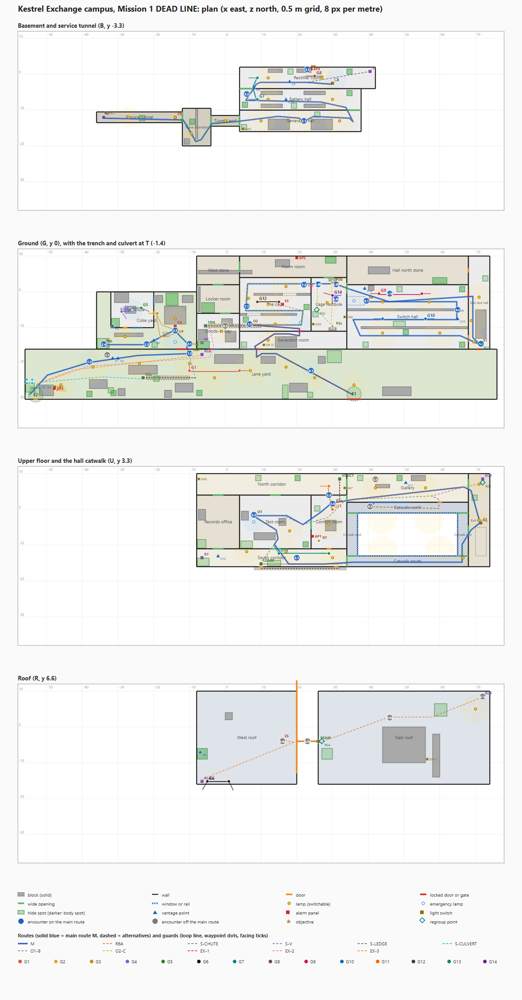

# Mission 1 DEAD LINE: campus map (D1)

Generated from `map-dead-line.json` by `map-dead-line-render.mjs`. Plan: `map-dead-line.svg` / `map-dead-line.png`. Evidence: `map-dead-line-validation.md`. Docs only: no game code. Units are metres on a 0.5 m grid, x east, z north. Levels: B (basement and tunnel, y -3.3), T (trench and culvert, y -1.4, crawl only), G (ground, 0), U (upper floor and hall catwalk, 3.3), R (roof, 6.6).

## Layout in one paragraph

The yard strip (x -56 to 76, z -30 to -16) runs along the south of everything. Arrival Gp is in its west corner, the van gate Gv in the middle. The coke yard (x -36 to -8, z -16 to 0) sits north of the west yard (gate CG). The main building (x -8 to 74, z -16 to 10) has the Goods-in and lockers in the west, the generator room, the cage and the vestibule in the middle (x 4 to 34) and the switch hall in the east (x 34 to 68) with the east stair hall (S1) beyond it. The plant basement lies under the hall and the cage block (x 4 to 42), reached from the coke yard by a service tunnel (36.5 m straight, 42.5 m walked through the valve chamber dogleg). Upper floor: records office and Test room in the west, Control room over the vestibule, the Gallery over the hall north store, a south corridor and a north corridor, and the catwalk ring inside the hall. The roof is two decks split by a glazed slot (x 20 to 26) that only the pipe beam crosses.

## Chapter times on the main route M (ideal walk)

| Ch | Chapter | Budget s | Range s (15%) | M ideal walk s | Path m | Jog m | Holds s | Link s | Result |
| --- | --- | --- | --- | --- | --- | --- | --- | --- | --- |
| 1 | Lane and yard | 30 | 25.5 - 34.5 | 27.8 | 47.6 | 0.0 | 4.0 | 0.0 | PASS |
| 2 | Coke yard and service tunnel | 45 | 38.3 - 51.7 | 42.5 | 72.3 | 0.0 | 3.0 | 3.3 | PASS |
| 3 | Plant basement | 45 | 38.3 - 51.7 | 48.8 | 93.5 | 34.3 | 0.0 | 7.0 | PASS |
| 4 | Switch hall | 60 | 51.0 - 69.0 | 58.5 | 98.0 | 0.0 | 0.0 | 9.5 | PASS |
| 5 | Upper floors | 60 | 51.0 - 69.0 | 60.4 | 104.9 | 0.0 | 8.0 | 0.0 | PASS |
| 6 | Approach to the cage | 50 | 42.5 - 57.5 | 54.7 | 107.5 | 60.1 | 0.0 | 9.5 | PASS |
| 7 | The cage | 35 | 29.8 - 40.3 | 34.8 | 61.5 | 0.0 | 4.0 | 0.0 | PASS |
| 8 | Breakout | 30 | 25.5 - 34.5 | 34.4 | 62.9 | 0.0 | 3.0 | 0.0 | PASS |

Total 361.9 s (6.0 min; target 5.5 to 6.5). Chapter 6 on M is the hall return (6B). The roof lane 6A takes 50.5 s (inside the range).

## Spaces

| Id | Name | Level | x0 z0 x1 z1 | Size m | Kind | Wall m | Floor | Chapters | Landmark | Purpose |
| --- | --- | --- | --- | --- | --- | --- | --- | --- | --- | --- |
| yard | Lane yard | G | -56 -30 76 -16 | 132.0 x 14.0 | outdoor | 3.7 | gravel | 1,8 | sodium lamp pools, gatehouse, parked vans, container stack | Arrival, the lamp rule is learned here; vehicle exit |
| coke | Coke yard | G | -36 -16 -8 0 | 28.0 x 16.0 | outdoor | 3.7 | gravel | 2 | coke bunker with chute grating, boiler house, steam pipes | First test: patrol, talking pair, sniper apron |
| boiler | Boiler house | G | -32 -10 -20 0 | 12.0 x 10.0 | main | 3.2 | concrete | 2 | boiler drum, table with a thermos, steam gauges | The talking pair; the clue about the plant breaker |
| goods | Goods-in bay | G | -8 -16 4 -6 | 12.0 x 10.0 | main | 3.3 | concrete | 8 | pallets, forklift, sealed roller door | Back route: riser foot, trench grille, personnel door |
| locker | Locker room | G | -8 -6 4 2 | 12.0 x 8.0 | minor | 3.3 | concrete | 8 | lockers, pinned rota | Body room and the way to the alarm room |
| wnorth | West store | G | -8 2 4 10 | 12.0 x 8.0 | minor | 3.3 | concrete | 8 | shelving, cable drums | Link from the locker room to the alarm room |
| gen | Generator room | G | 4 -16 34 -11 | 30.0 x 5.0 | main | 3.3 | concrete | 8 | standby genset, fuel day tank, hum | Breakout route to the yard door GD; switch SW10 |
| cage | The cage | G | 4 -11 24 4 | 20.0 x 15.0 | main | 3.3 | concrete | 7 | core switch bay, red LINE RECORDS sign, caged racks | O2 (plant the tap), the heavy loops the core switch |
| vest | Cage vestibule | G | 24 -11 34 4 | 10.0 x 15.0 | main | 3.3 | concrete | 6,7 | breaker pair BK1 and BK2, yellow door frame | Quick way to open the cage; the sentry G14 |
| alarmrm | Alarm room | G | 4 4 34 10 | 30.0 x 6.0 | minor | 3.3 | concrete | 7 | alarm panel AP2, kettle, rota board | AP2 and a way round the vestibule |
| hall | Switch hall | G | 34 -16 68 2 | 34.0 x 18.0 | main | 6.6 | concrete | 4,6 | rack lines, catwalk ring, green status lamps, hum | The serpentine of three lanes; the hall pair |
| hnorth | Hall north store | G | 34 2 68 10 | 34.0 x 8.0 | minor | 3.3 | concrete | 4 | spare racks, trolley, labelled bins | Dead end with a reward (the guard schedule) |
| stairE | East stair hall | G | 68 -16 74 10 | 6.0 x 26.0 | main | 3.3 | concrete | 4,6 | open feature stair S1, blue fire-door signs | S1 up to the Gallery; return into the hall |
| tun1 | Service tunnel | B | -36 -13.5 -12 -10.5 | 24.0 x 3.0 | tunnel | 2.6 | concrete | 2 | pipe racks, cable trays, a lamp every 10 m | Dark under-floor route from the coke yard |
| tun2 | Valve chamber | B | -12 -20 -4 -9.5 | 8.0 x 10.5 | tunnel | 2.6 | concrete | 2 | valve wheels, a dripping pipe | A dogleg that adds length and a hide spot |
| tun3 | Tunnel end | B | -4 -14.5 4 -11.5 | 8.0 x 3.0 | tunnel | 2.6 | concrete | 2 | grey blast door frame (open) | Arrives in the generator hall |
| bay1 | Generator hall | B | 4 -16 38 -10 | 34.0 x 6.0 | main | 3 | concrete | 3 | two big gensets, hum, bright | Lane 1 of the plant serpentine |
| bay2 | Battery hall | B | 4 -10 38 -4 | 34.0 x 6.0 | main | 3 | concrete | 3 | battery racks, acid smell sign | Lane 2; the patroller G7 |
| bay3 | Rectifier room | B | 4 -4 42 2 | 38.0 x 6.0 | main | 3 | concrete | 3 | rectifier cabinets, breaker panel BP | Lane 3; BP and the stair B |
| trench | Cable trench | T | -6 -10 10 -9 | 16.0 x 1.0 | duct | 1.3 | concrete | 8 | cable trays under a steel grille | Crawl from the cage to the Goods-in |
| culvert | Drain culvert | T | -22 -24.5 -10 -23.5 | 12.0 x 1.0 | duct | 1.3 | concrete | 1 | concrete pipe under the yard | Crawl under the lit stretch |
| test | Test room | U | 4 -11 24 4 | 20.0 x 15.0 | main | 3 | concrete | 5 | test bench, card cabinet with a lit sign, emergency lamp, the ES riser closet | O1 (pull the circuit record); the exhaust shaft passes through it |
| uoff | Records office | U | -8 -11 4 4 | 12.0 x 15.0 | minor | 3 | concrete | 5 | filing cabinets, a dead telex | Dead end with a reward (the shift roster); R1 riser top is next door |
| ucorrS | South corridor | U | -8 -16 34 -11 | 42.0 x 5.0 | corr | 3 | concrete | 5 | long lit corridor with window slots to the yard | Lit crossing; the window ledge is its dark alternative |
| ucorrN | North corridor | U | -8 4 34 10 | 42.0 x 6.0 | corr | 3 | concrete | 5 | filing cabinets, a notice board, ladder GL hatch on the roof side | Second long corridor; ring with the south corridor |
| ctl | Control room | U | 24 -11 34 4 | 10.0 x 15.0 | main | 3 | carpet | 5 | console, wall of screens, panel CP, roster terminal | CP (P2 quiet), bonus roster terminal; the officer |
| gallery | Gallery | U | 34 2 68 10 | 34.0 x 8.0 | corr | 3 | wood | 5 | long window W1 over the hall, display cases | Watch the officer and the hall; G13 |
| ulobE | East landing | U | 68 -16 74 10 | 6.0 x 26.0 | minor | 3 | concrete | 4,5 | stair S1 top, roof ladder GL, fire-door sign | S1 arrives here; GL to the roof |
| cwS | Catwalk south | U | 34 -16 68 -13 | 34.0 x 3.0 | catwalk | 3 | grate | 4 | steel grating, rail over the hall | Loud overhead route |
| cwN | Catwalk north | U | 34 -1 68 2 | 34.0 x 3.0 | catwalk | 3 | grate | 4 | steel grating, rail over the hall | Overhead route to the Gallery door |
| cwW | Catwalk west | U | 34 -13 37 -1 | 3.0 x 12.0 | catwalk | 3 | grate | 4 | steel grating, V shaft hatch | V shaft arrival |
| cwE | Catwalk east | U | 65 -13 68 -1 | 3.0 x 12.0 | catwalk | 3 | grate | 4 | steel grating, rail over the hall | Link to the east landing |
| ledge | Window ledge | U | 8 -17 34 -16 | 26.0 x 1.0 | ledge | 1 | concrete | 5 | stone cornice, rain | Outside bypass of the lit south corridor |
| roofW | West roof | R | -8 -16 20 10 | 28.0 x 26.0 | roof | 0.9 | gravel | 6 | exhaust shaft ES, aerial mast, parapet | Sniper post G6; ES drop |
| roofE | East roof | R | 26 -16 74 10 | 48.0 x 26.0 | roof | 0.9 | gravel | 6 | plant room with fans, red beacon | Ladder top; fan noise |

## Doors, openings and locks

| Id | Type | Level | Wall | Centre | Width m | From | To | Lock | Purpose |
| --- | --- | --- | --- | --- | --- | --- | --- | --- | --- |
| Gp | door1 | G | z=-30 | -53 | 1.2 | lane | yard |  | Arrival gate and the alternate exit (E2) |
| Gv | gate | G | z=-30 | 36 | 4 | lane | yard | locked from outside; opens from inside; alarm locks it 60 s | Vehicle gate, primary exit (E1) |
| CG | gate | G | z=-16 | -12 | 3 | yard | coke | hold 4 s with the cutters (yard side) | Coke yard gate: gate out of Chapter 1 |
| PD | door1 | G | z=-16 | -4 | 1.2 | yard | goods | locked from outside; hold 3 s from inside | Personnel door: opens from inside only; trench exit route |
| RD | sealed | G | z=-16 | 3 | 3 | yard | goods |  | Sealed roller door (landmark) |
| GD | door2 | G | z=-16 | 9 | 1.8 | yard | gen | locked from outside; hold 3 s from inside | Generator room door to the yard (breakout) |
| FD1 | door1 | G | z=-16 | 71 | 1.2 | yard | stairE | locked from outside; opens from inside (fire exit) | Fire exit from the east stair hall to the yard |
| BH1 | door1 | G | x=-20 | -6 | 1.2 | boiler | coke |  | Boiler house east door (the pair look out of it) |
| BH2 | door1 | G | z=-10 | -28 | 1.2 | boiler | coke |  | Boiler house south door |
| BHW1 | window | G | z=-10 | -24.5 | 3 | boiler | coke |  | South window: the pair watch the pipe crawl from it |
| BHW2 | window | G | x=-20 | -2.5 | 2 | boiler | coke |  | East window |
| GL1 | wide | G | z=-6 | 0 | 3 | goods | locker |  | Goods-in to locker room |
| LW1 | wide | G | z=2 | -2 | 3 | locker | wnorth |  | Locker room to the west store |
| WA1 | wide | G | x=4 | 7 | 3 | wnorth | alarmrm |  | West store to the alarm room |
| AV1 | wide | G | z=4 | 29 | 3 | vest | alarmrm |  | Alarm room to the vestibule |
| GDW | window | G | z=-16 | 7.5 | 2 | yard | gen |  | Window beside GD: a guard in the yard can see the hold at the door |
| PDW | window | G | z=-16 | -2.3 | 1.8 | yard | goods |  | Window beside PD: a guard in the yard can see the hold at the door |
| GCd | door2 | G | z=-11 | 21 | 1.8 | gen | cage | locked until P2 (CP release, or BK1 + BK2, or the shaft drop) | Cage back door to the generator room (the breakout) |
| CH | door2 | G | x=24 | 1.5 | 2 | vest | cage | locked until P2 | Cage front door |
| VH | wide | G | x=34 | 1 | 3 | hall | vest |  | Hall to the vestibule (end of the lane A) |
| SD1 | door2 | G | x=68 | -13 | 1.8 | hall | stairE |  | Hall lane C to the East stair hall (S1) |
| SD2 | door2 | G | x=68 | -1 | 1.8 | hall | stairE | push-bar: opens from the stair side only; the hall side stays locked until opened once | Hall lane A to the East stair hall (the return, 6B) |
| HNd | door1 | G | x=68 | 6 | 1.2 | hnorth | stairE |  | Hall north store (dead end, reward) |
| BC1 | open | B | z=-10 | 36 | 4 | bay1 | bay2 |  | East connector of the serpentine |
| BC2 | open | B | z=-4 | 6 | 4 | bay2 | bay3 |  | West connector of the serpentine |
| TJ1 | wide | B | x=-12 | -12 | 3 | tun1 | tun2 |  | Tunnel to the valve chamber |
| TJ2 | wide | B | x=-4 | -13 | 3 | tun2 | tun3 |  | Valve chamber to the tunnel end |
| TJ3 | wide | B | x=4 | -13 | 3 | tun3 | bay1 |  | Tunnel end to the generator hall |
| TS | wide | U | z=-11 | 14 | 3 | ucorrS | test |  | South corridor to the Test room |
| TN | wide | U | z=4 | 14 | 3 | test | ucorrN |  | Test room to the north corridor |
| TC | wide | U | x=24 | -4 | 3 | test | ctl |  | Test room to the Control room (the officer's back way) |
| CE2 | wide | U | x=34 | 3 | 2 | ctl | gallery |  | Control room to the Gallery (the direct way to the east landing) |
| UOS | wide | U | z=-11 | -2 | 3 | ucorrS | uoff |  | South corridor to the Records office |
| UON | wide | U | z=4 | -2 | 3 | uoff | ucorrN |  | Records office to the north corridor |
| CS | door1 | U | z=-11 | 29 | 1.2 | ucorrS | ctl |  | Control room south door (the officer opens it) |
| CN | door1 | U | z=4 | 29 | 1.2 | ctl | ucorrN |  | Control room north door |
| GW | wide | U | x=34 | 7 | 3 | ucorrN | gallery |  | North corridor to the Gallery |
| CSW | wide | U | x=34 | -14.5 | 3 | ucorrS | cwS |  | Opening from the south corridor to the catwalk (the fire doors stand open at night) |
| W1 | window | U | z=2 | 46 | 12 | gallery | cwN |  | Gallery window over the hall (watch the pair and the heavy door) |
| FDg | door1 | U | z=2 | 60 | 1.2 | gallery | cwN |  | Gallery to the catwalk north strip |
| GE | wide | U | x=68 | 7 | 3 | gallery | ulobE |  | Gallery to the east landing |
| CE | wide | U | x=68 | -6 | 3 | cwE | ulobE |  | Catwalk east strip to the east landing |
| LWa | door1 | U | z=-16 | 10 | 1.2 | ucorrS | ledge |  | Window out onto the ledge (west end) |
| LWb | door1 | U | z=-16 | 31 | 1.2 | ucorrS | ledge |  | Window out onto the ledge (east end) |
| CJ1 | open | U | z=-13 | 35.5 | 3 | cwW | cwS |  | Catwalk corner SW |
| CJ2 | open | U | z=-1 | 35.5 | 3 | cwW | cwN |  | Catwalk corner NW |
| CJ3 | open | U | z=-13 | 66.5 | 3 | cwE | cwS |  | Catwalk corner SE |
| CJ4 | open | U | z=-1 | 66.5 | 3 | cwE | cwN |  | Catwalk corner NE |
| RL1 | rail | U | z=-13 | 51 | 28 | cwS | hall |  | Rail over the hall (south strip) |
| RL2 | rail | U | z=-1 | 51 | 28 | cwN | hall |  | Rail over the hall (north strip) |
| RL3 | rail | U | x=37 | -7 | 12 | cwW | hall |  | Rail over the hall (west strip) |
| RL4 | rail | U | x=65 | -7 | 12 | cwE | hall |  | Rail over the hall (east strip) |
| SLOT | void | R | x=20 | 0 | 26 | roofW | roofE |  | Glazed skylight slot: the pipe beam is the only crossing |

## Vertical links, ladders, ducts, trenches, ledge and beam

| Id | Kind | From | To | Travel s | One way | Lock | Note |
| --- | --- | --- | --- | --- | --- | --- | --- |
| H | ladder | G (-34.0, -14.5) | B (-34.0, -12.0) | 3.3 |  | hold 3 s at the hatch (coke yard side); free from the tunnel side | Tunnel hatch with a 3.3 m ladder |
| CK | drop | G (-14.0, -9.5) | B (-14.0, -12.0) | 1.5 | yes |  | Coke chute: one-way 3.3 m drop (roll band), lit landing in the tunnel |
| SB | stairs-open | B (30.0, -2.5) | G (39.5, -2.5) | 7 |  |  | Stair B: 2.4 wide, 20 risers 0.165 x 0.285, mid landing 2.0 |
| V | ladder | B (40.5, 0.8) | U (40.5, 0.8) | 6.6 |  |  | V shaft: 6.6 m ladder from the rectifier room east end to the catwalk north strip, through the riser cage in the hall (x 40, z 0.4) |
| S1 | stairs-open | G (71.5, -14.5) | U (71.5, -3.8) | 9.5 |  |  | S1: open feature stair in the east stair hall, 2.4 wide, 20 risers |
| R1 | ladder | G (-6.5, -14.2) | U (-6.5, -13.5) | 3.3 |  | bolted at the Goods-in end; opens from the south corridor end (hold 3 s) | Riser ladder in the Goods-in south-west corner to the south corridor |
| GLd | ladder | U (72.0, 8.5) | R (72.0, 8.5) | 3.3 |  | roof hatch bolted until P1 is done (card 14 opens it, hold 3 s) | Gallery ladder GL: east landing to the roof |
| RLd | ladder | G (-6.5, -17.5) | R (-6.5, -15.2) | 6.6 |  | retracted; drops from the roof side (hold 3 s), then both ways | Roof ladder RL on the west end of the south facade |
| ES | drop | R (16.0, -3.5) | G (16.0, -3.5) | 2 | yes |  | Exhaust shaft ES: one-way 6.6 m drop into the cage middle lane (heavy landing, loud) |
| BEAM | beam | R (26.0, -4.0) | R (20.0, -4.0) | 6.7 |  |  | Pipe beam over the skylight slot: 0.6 wide, 6 m, slow gear (0.9 m/s) |
| TRN | crawl | G (-5.5, -9.5) | G (5.5, -9.5) | 9.1 |  | bolted from the Goods-in side; opens from the cage end (hold 3 s) | Cable trench under the grille: 11 m crawl at 1.8 m/s plus two 1.5 s grille climbs, 1.0 wide, 1.3 high, player only |
| CUL | crawl | G (-23.0, -24.0) | G (-8.0, -24.0) | 9.9 |  |  | Drain culvert under the yard: 12 m crawl plus two 1.2 s mouths |
| VDUCT | crawl | U (32.0, 8.5) | U (32.0, 2.5) | 5.3 |  |  | Ventilation duct from the north corridor east end into the Control room: 6 m crawl, 1.3 high, guards cannot enter |
| LEDGE | ledge | U (10.0, -15.2) | U (32.0, -15.2) | 26.4 |  |  | Window ledge: 22 m at 0.9 m/s plus 1 s out and 1 s in; 0.8 wide, outside the facade |

59 blocks (cover, racks, vehicles, rack lines) are in the JSON `blocks` list with their heights; rack lines are 2.4 m solid with end gaps, the cage windows CMESH and CMESH2 pass sight above 1.0 m.

## Lamps and circuits

| Circuit | Name | Switch | Lamps | Guard reaction | Search s |
| --- | --- | --- | --- | --- | --- |
| C1 | Yard west lamps | SW1 G (-47.6, -26.5): on the gatehouse wall, in G2's post | Y1-Y6, plus the unswitchable YE1 | G1: goes to the nearest dead pole, searches 12 s with a torch; G2 turns to the switch for 8 s (30 s alert level suspicious); G6 holds on the yard 10 s. A shot lamp: G1 walks to that lamp, 8 s. | 12 |
| C10 | Yard east lamps and generator room | SW10 G (10.8, -14.8): inside the generator room by GD | Y7-Y9, GN1, plus the unswitchable YE2 | G1: G1 walks east to the first dead pole and searches 12 s; G6 holds on the east yard 10 s. | 12 |
| C2 | Coke yard lamps | SW2 G (-9.6, -14.5): on the inside of the gate post, 1 m from CG | CY2-CY3, plus the unswitchable CY1 | G3: G3 walks to the switch and then to the dead lamp, 12 s search; the pair G4 and G5 look out of BH1 for 6 s. | 12 |
| C2T | Tunnel lamps | SW2T B (-33.4, -10.8): at the foot of the hatch ladder | TL1, TL2, TL4 | G7: a tunnel fault shows on the plant board: G7 walks to the tunnel end and looks down it for 10 s, then returns. | 10 |
| C3 | Plant lamps | SW3 B (5.0, -15.2): generator hall west wall, beside the tunnel arrival | PA1-PA3, PB1-PB2, PC1-PC2 | G7, G8: G7 walks to the nearest dead lamp and searches 12 s; G8 holds his post and turns to face the panel for 8 s. | 12 |
| C4 | Hall north lane lamps | BP B (23.0, 1.4): breaker panel BP in the rectifier room (hold 4 s); trips C4 and C5 together | HA1-HA2 | G9, G10: the pair walk to the hall breaker board in the stair hall (66, -2) and reset it, 15 s; C4 and C5 come back on after 45 s unless the board is held. | 15 |
| C5 | Hall south lane lamps | BP B (23.0, 1.4): same panel BP as C4 | HC1-HC2, SL1-SL3, CWL2 | G9, G10: as C4 | 15 |
| C6 | Upper corridor lamps | SW6 U (-7.4, 8.5): north corridor west end | UA1-UA3, TR2 | G11, G13: G11 walks to the switch and then along the dead corridor, 15 s; G13 holds the Gallery door. | 15 |
| C7 | Control room and Gallery lamps | SW7 U (33.4, 6.0): north corridor east end, beside GW | CT1, GA1-GA2, UL1-UL2 | G11, G13: G11 goes to AP1 and radios; G13 walks to the dead lamps in the Gallery, 12 s. | 12 |
| C8 | Vestibule and alarm room lamps | SW8 G (33.4, -7.0): vestibule east wall, beside VH | VB1-VB2 | G14: G14 steps to the switch, looks around the vestibule for 10 s, then returns to his post. | 10 |
| C9 | Cage lamps | SW5 G (24.6, -9.0): vestibule west wall, 3 m south of CH | K1-K4 | G12, G14: G12 turns to the dead lamp and holds 10 s (never leaves the core); G14 goes to the switch, 10 s. | 10 |
| C11 | Roof beacon | SW11 R (56.5, -9.0): plant room east wall | RB1 | G6: G6 turns to the ladder head and holds 10 s. | 10 |

| Lamp | Circuit | Level | x, z | Height | Range | Intensity | Shootable | Note |
| --- | --- | --- | --- | --- | --- | --- | --- | --- |
| Y1 | C1 | G | (-46.0, -26.0) | 4 | 7 | 1 | yes | lamp on the gatehouse, G2 stands in its pool |
| Y2 | C1 | G | (-37.0, -21.0) | 5 | 9 | 1 | yes | pole lamp, first lit stretch |
| Y3 | C1 | G | (-24.0, -20.0) | 5 | 9 | 1 | yes | pole lamp south, behind the van line |
| Y4 | C1 | G | (-10.0, -20.0) | 5 | 9 | 1 | yes | pole lamp at the coke yard gate (G1 west end) |
| Y5 | C1 | G | (-3.0, -24.0) | 5 | 9 | 1 | yes | pole lamp, yard centre |
| Y6 | C1 | G | (7.0, -22.0) | 5 | 9 | 1 | yes | pole lamp (G1 east end) |
| Y7 | C10 | G | (17.0, -21.0) | 5 | 6.5 | 1.4 | yes | pole lamp over the generator room door GD |
| Y8 | C10 | G | (25.0, -24.0) | 5 | 6.5 | 1.4 | yes | pole lamp, east yard |
| Y9 | C10 | G | (36.0, -26.0) | 5 | 6.5 | 1 | yes | pole lamp over the vehicle gate Gv (the van pool) |
| GN1 | C10 | G | (12.0, -13.5) | 2.9 | 6 | 1 | yes | generator room strip, west |
| CY1 | E | G | (-14.0, -14.0) | 4.5 | 6.5 | 1 | no | caged gate lamp inside the coke yard gate CG (cannot be switched) |
| CY3 | C2 | G | (-28.0, -12.5) | 4.5 | 6.5 | 1 | yes | lamp over the pipe rack west end (the hatch H stays at the edge of its pool) |
| CY2 | C2 | G | (-14.0, -7.5) | 4.5 | 6.5 | 1 | yes | chute lamp over the coke bunker apron (the one lit pool) |
| EB1 | E | G | (-26.0, -5.0) | 2.8 | 6 | 1 | no | boiler house emergency lamp (cannot be switched, lights the pair) |
| TL1 | C2T | B | (-27.0, -12.0) | 2.2 | 6 | 1 | yes | tunnel lamp at the hatch |
| TL2 | C2T | B | (-14.0, -12.0) | 2.2 | 4.2 | 1 | yes | tunnel lamp at the chute landing (lit landing) |
| TL3 | C2T | B | (-9.5, -16.5) | 2.2 | 4.5 | 1 | yes | valve chamber lamp (lights the dogleg) |
| TL4 | C2T | B | (0.0, -13.0) | 2.2 | 4.2 | 1 | yes | tunnel end lamp |
| PA1 | C3 | B | (10.0, -13.0) | 2.8 | 8 | 1 | yes | generator hall, west |
| PA2 | C3 | B | (21.0, -13.0) | 2.8 | 8 | 1 | yes | generator hall, centre (bright) |
| PA3 | C3 | B | (32.0, -13.0) | 2.8 | 8 | 1 | yes | generator hall, east |
| PB2 | C3 | B | (30.0, -7.0) | 2.8 | 7 | 1 | yes | battery hall east |
| PB1 | C3 | B | (12.0, -7.0) | 2.8 | 7 | 1 | yes | battery hall |
| PC1 | C3 | B | (12.0, -1.0) | 2.8 | 7 | 1 | yes | rectifier room west |
| PC2 | C3 | B | (27.0, -1.0) | 2.8 | 7 | 1 | yes | rectifier room, G8 stands here |
| PE1 | E | B | (31.0, -1.5) | 2.8 | 6 | 1 | no | emergency lamp at the stair foot and the V foot (cannot be switched) |
| HA1 | C4 | G | (44.0, -2.8) | 5.5 | 8.2 | 1 | yes | hall lane A, west |
| HA2 | C4 | G | (57.0, -2.8) | 5.5 | 8.2 | 1 | yes | hall lane A, east |
| HC1 | C5 | G | (44.0, -11.5) | 5.5 | 8.2 | 1 | yes | hall lane C, west |
| HC2 | C5 | G | (60.0, -11.5) | 5.5 | 8.2 | 1 | yes | hall lane C, east |
| HE1 | E | G | (36.0, -2.5) | 3 | 6 | 1 | no | green exit lamp over the stair B well (cannot be switched) |
| SL1 | C5 | G | (68.8, -8.0) | 3 | 8 | 1 | yes | stair hall lamp west of S1 |
| VB2 | C8 | G | (31.0, 2.0) | 2.9 | 6 | 1 | yes | vestibule lamp north (BK1) |
| VB1 | C8 | G | (28.5, -3.0) | 2.9 | 7 | 1 | yes | vestibule lamp (breaker pair) |
| K1 | C9 | G | (14.0, -9.0) | 3 | 8 | 1 | yes | cage lamp over lane S (O2 at the west end stays in the shade) |
| K2 | C9 | G | (12.0, -3.5) | 3 | 8 | 1 | yes | cage lamp over the middle lane west half (the heavy's west turn) |
| GI1 | C1 | G | (-1.0, -11.0) | 2.9 | 7 | 1 | yes | Goods-in strip lamp (fed by the yard circuit) |
| K4 | C9 | G | (6.5, -1.8) | 3 | 6 | 1 | yes | cage lamp at the west gap |
| K3 | C9 | G | (17.0, 1.5) | 3 | 8 | 1 | yes | cage lamp over the entry lane |
| EK1 | E | G | (21.0, -8.6) | 3 | 6 | 1 | no | cage emergency lamp, lane S east (cannot be switched) |
| UA1 | C6 | U | (6.0, -11.8) | 3 | 6.5 | 1 | yes | south corridor lamp, west (mounted on the north wall: the south wall strip stays dark) |
| UA2 | C6 | U | (17.0, -11.8) | 3 | 6.5 | 1 | yes | south corridor lamp, centre (north wall) |
| UA3 | C6 | U | (30.0, -13.5) | 3 | 7 | 1 | yes | south corridor lamp, east: lights the full width (the unavoidable lit patch, G13 covers it) |
| CT1 | C7 | U | (29.0, -4.0) | 3 | 8 | 1 | yes | Control room strip (bright) |
| GA2 | C7 | U | (56.0, 6.0) | 3 | 7 | 1 | yes | Gallery lamp, east |
| UL1 | C7 | U | (71.0, -3.0) | 3 | 6 | 1 | yes | east landing lamp |
| UL2 | C7 | U | (71.0, 7.0) | 3 | 6 | 1 | yes | lamp over the GL hatch |
| GA1 | C7 | U | (42.0, 6.0) | 3 | 7 | 1 | yes | Gallery lamp, west |
| TR2 | C6 | U | (18.0, -6.0) | 3 | 7 | 1 | yes | Test room lamp, east half |
| CWL2 | C5 | U | (66.5, -13.5) | 3 | 6 | 1 | yes | catwalk lamp at the south-east corner |
| SL2 | C5 | G | (71.0, -1.5) | 3 | 8 | 1 | yes | stair hall lamp by SD2 |
| SL3 | C5 | G | (69.5, -14.0) | 3 | 6 | 1 | yes | stair hall lamp at the S1 foot |
| ET1 | E | U | (8.0, -3.5) | 3 | 6 | 1 | no | Test room emergency lamp over the card cabinet (cannot be switched) |
| RB1 | C11 | R | (70.0, 5.0) | 3.5 | 8 | 1 | yes | ladder head beacon |
| YE1 | E | G | (-38.0, -19.0) | 4 | 5.5 | 1 | no | caged security lamp on the coke yard fence (cannot be switched) |
| YE2 | E | G | (24.0, -21.5) | 4 | 5.5 | 1 | no | wall-pack lamp on the generator room wall (cannot be switched) |

## Alarm panels

| Id | Level | x, z | Note |
| --- | --- | --- | --- |
| AP1 | U | (24.4, -7.5) | the officer's panel on the Control room west wall; sends reinforcements R1 and R2 to Gv |
| AP2 | G | (20.0, 9.5) | alarm room panel, north wall |
| AP3 | G | (-47.8, -27.0) | gatehouse panel (G2 and G1 run to it) |
| AP4 | B | (24.0, 1.5) | plant panel beside BP (G7 and G8) |

## Hide spots (1.5 m deep and wide or larger, dark)

| Id | Level | Space | Rect | Opens | Body spot | Enclosure | Guards it shows |
| --- | --- | --- | --- | --- | --- | --- | --- |
| hY1 | G | yard | -55.8 -28 -53.4 -25.4 | E |  | spawn pocket: the fence west, GH east; dark |  |
| hY2 | G | yard | -32 -29 -30.5 -27.5 | N | yes | dark 1.5 x 1.5 m pocket backed by the south and east wall or block; body spot | G1 |
| hY3 | G | yard | -20 -25 -18.5 -23.5 | S |  | dark 1.5 x 1.5 m pocket backed by the north wall or block | G1 |
| hY4 | G | yard | -8 -29 -6.5 -27.5 | N | yes | dark 1.5 x 1.5 m pocket backed by the south wall or block; body spot | G1 |
| hY5 | G | yard | 4.5 -15.5 6 -14 | N |  | dark 1.5 x 1.5 m pocket backed by the south and west wall or block | G1 |
| hY6 | G | yard | 16 -29.8 17.6 -26 | E |  | VAN3 west; the fence |  |
| hY8 | G | yard | 23 -29.5 24.5 -28 | N |  | dark 1.5 x 1.5 m pocket backed by the south wall or block |  |
| hY7 | G | yard | 28.5 -19.8 32.5 -16.4 | S |  | DS3 east, wall north |  |
| hC1 | G | coke | -35.8 -15.8 -32.5 -13 | E |  | west end of the pipe rack PIPES, hatch H next to it, dark | G4,G5 |
| hC2 | G | coke | -16.6 -3.8 -13.2 -0.4 | S | yes | north of BNK, CT4 west; dark body spot for G3 | G3 |
| hC3 | G | coke | -20.5 -15.5 -19 -14 | N |  | dark 1.5 x 1.5 m pocket backed by the south wall or block | G3 |
| hB1 | G | boiler | -31.8 -9.8 -29.6 -7.4 | E | yes | boiler house SW corner: BDRUM north; body spot for G4 and G5 | G4,G5 |
| hT1 | B | tun1 | -24 -13 -22.5 -11.5 | N |  | dark 1.5 x 1.5 m pocket backed by the south wall or block |  |
| hT2 | B | tun2 | -10 -14 -8.5 -12.5 | N | yes | dark 1.5 x 1.5 m pocket backed by the east wall or block; body spot | G7 |
| hP1 | B | bay1 | 4.5 -15.5 6 -14 | N |  | dark 1.5 x 1.5 m pocket backed by the south and west wall or block |  |
| hP2 | B | bay1 | 25 -12 26.5 -10.5 | E |  | dark 1.5 x 1.5 m pocket backed by the north and south wall or block |  |
| hP3 | B | bay2 | 18.5 -9.5 20 -8 | N |  | dark 1.5 x 1.5 m pocket backed by the south wall or block |  |
| hP4 | B | bay2 | 34 -6 35.5 -4.5 | S | yes | dark 1.5 x 1.5 m pocket backed by the north wall or block; body spot | G7 |
| hP5 | B | bay3 | 17.5 0 19 1.5 | S |  | dark 1.5 x 1.5 m pocket backed by the north wall or block | G8 |
| hP6 | B | bay3 | 34 0 35.5 1.5 | S | yes | dark 1.5 x 1.5 m pocket backed by the north wall or block; body spot | G8 |
| hH1 | G | hall | 48 0 49.5 1.5 | S |  | dark 1.5 x 1.5 m pocket backed by the north wall or block | G9 |
| hH2 | G | hall | 65.5 0 67 1.5 | S | yes | dark 1.5 x 1.5 m pocket backed by the north wall or block; body spot | G9 |
| hH3 | G | hall | 47 -9.7 50.4 -8.2 | N |  | lane B south side by the rack line 2, lamp HB1 shadow | G10 |
| hH4 | G | hall | 65.5 -15.5 67 -14 | N | yes | dark 1.5 x 1.5 m pocket backed by the south wall or block; body spot | G10 |
| hH5 | G | hall | 38.5 -15.5 40 -14 | N |  | dark 1.5 x 1.5 m pocket backed by the south wall or block |  |
| hS1 | G | stairE | 72 3 73.5 4.5 | N |  | dark 1.5 x 1.5 m pocket backed by the east wall or block |  |
| hN1 | G | hnorth | 58 2.3 62 4 | S | yes | hall north store: bins east; body spot | G9 |
| hG1 | G | goods | -7.8 -15.8 -4.4 -13.8 | E | yes | PAL2 south, wall south and west: the riser foot behind the pallet stack |  |
| hG2 | G | locker | -6.6 -5.8 -3 -3 | E | yes | lockers west (LK1), dark body room |  |
| hV1 | G | vest | 24.5 -7 26 -5.5 | N |  | dark 1.5 x 1.5 m pocket backed by the west wall or block | G14 |
| hK1 | G | cage | 5 -8.5 6.5 -7 | S | yes | dark 1.5 x 1.5 m pocket backed by the north and west wall or block | G12 |
| hK2 | G | cage | 22 -5 23.5 -3.5 | N | yes | dark 1.5 x 1.5 m pocket backed by the east wall or block; body spot | G12 |
| hA1 | G | alarmrm | 28 8 31 9.8 | S | yes | alarm room east corner by DESK1; body spot for G14 | G14 |
| hU1 | U | ucorrS | -7.8 -15.8 -4.5 -13.6 | E |  | south corridor west end: R1 ladder top, dark |  |
| hU2 | U | ucorrS | 11.8 -15.8 15.5 -14.2 | N |  | south corridor window bay between UA1 and UA2 |  |
| hU3 | U | ucorrN | 8.5 8 10 9.5 | S |  | dark 1.5 x 1.5 m pocket backed by the north wall or block | G11 |
| hU4 | U | ucorrN | 19.5 8 21 9.5 | S | yes | dark 1.5 x 1.5 m pocket backed by the north wall or block; body spot | G11 |
| hU5 | U | uoff | -7.8 -10.8 -5.4 -8.4 | N |  | Records office south-west corner (dead end reward) |  |
| hU10 | U | test | 4.4 -10.8 7.6 -8.8 | E |  | Test room south-west niche by TS, dark |  |
| hU6 | U | gallery | 37 8 38.5 9.5 | S |  | dark 1.5 x 1.5 m pocket backed by the north wall or block | G13 |
| hU7 | U | gallery | 48 8 49.5 9.5 | S | yes | dark 1.5 x 1.5 m pocket backed by the north wall or block; body spot | G13 |
| hU8 | U | ulobE | 69 2.5 70.5 4 | N |  | dark 1.5 x 1.5 m pocket backed by the west wall or block |  |
| hU9 | U | ctl | 25 -0.5 26.5 1 | N |  | dark 1.5 x 1.5 m pocket backed by the west wall or block | G11 |
| hR1 | R | roofW | -7.8 -9 -5 -6 | E | yes | roof west parapet pocket; body spot | G6 |
| hR2 | R | roofE | 58.5 3 62 6.5 | S |  | plant room lee |  |
| hR3 | R | roofE | 27 -9 30 -6 | E |  | beam east anchor kerb pocket |  |
| hb2 | G | yard | -38.75 -29.25 -37.25 -27.75 | N | yes | dark 1.5 x 1.5 m pocket in the corner by the south fence and VAN1; body spot for G2 | G2 |
| hb7 | B | bay2 | 4.75 -9.25 6.25 -7.75 | E | yes | dark 1.5 x 1.5 m pocket in the battery hall west corner; body spot for G7 | G7 |
| hb10 | G | hall | 49.75 -12 51.25 -10.5 | N | yes | dark 1.5 x 1.5 m pocket under the catwalk south strip beside the rack line 2; body spot for G10 | G10 |
| hb13 | U | test | 21.75 -10.5 23.25 -9 | N | yes | dark 1.5 x 1.5 m pocket in the Test room south-east corner; body spot for G13 | G13 |
| hY9 | G | yard | -32.75 -28.25 -31.25 -26.75 | N |  | dark 1.5 x 1.5 m pocket east of VAN1 by the south fence (the culvert route) |  |

## Vantage points

| Id | Level | x, z | Shows | Note |
| --- | --- | --- | --- | --- |
| V1 | G | (-31.5, -18.5) | G1 | yard lookout against the coke yard wall, 17 m from G1: sees his whole loop |
| V2 | G | (-30.0, -18.5) | G2 | yard wall pocket, 28 m from the gatehouse: sees the three facings of the sentry |
| V3 | G | (-34.0, -14.5) | G3 | pipe crawl west end by the hatch: sees G3 at the bunker apron |
| V4 | G | (-20.0, -13.5) | G4 | coke yard south-east of the boiler house: sees the pair through the south window |
| V5 | G | (-31.5, -9.5) | G5 | boiler house south-west corner outside: sees the east seat |
| V6 | R | (-7.0, -7.0) | G6 | roof west parapet pocket: sees the whole parapet run of the sniper |
| V7 | B | (18.0, -2.0) | G7 | rectifier room, between the cabinets: sees G7 at the west connector |
| V7b | B | (17.0, -7.0) | G7 | battery hall between the rack rows: sees G7 at the battery bank |
| V8 | B | (8.0, -3.5) | G8 | rectifier room west end: sees G8 down lane 3 |
| V9 | G | (65.0, -4.5) | G9 | hall east connector pocket: sees lane A |
| V10 | G | (65.0, -7.5) | G10 | hall east connector pocket: sees lane B |
| V11 | U | (50.5, 7.5) | G11 | Gallery display-case bay: sees the officer at the north corridor end through GW |
| V12 | U | (-2.0, -13.0) | G13 | south corridor west bay: sees the lit patrol of G13 |
| V13 | G | (22.5, 2.5) | G12 | cage entry lane east end (just inside CH): sees the heavy at his east turn through the cage window CMESH |
| V14 | G | (39.0, 1.0) | G14 | hall lane A under the catwalk: sees G14 in the vestibule through VH |

## Spawns, objectives, exits, regroup points

| Id | Level | x, z | Hold s | Note |
| --- | --- | --- | --- | --- |
| S1 | G | (-55.5, -25.5) |  | Wait in the pocket and watch the yard: G1 and the lamp Y1 are in view, nobody sees you |
| S2 | G | (-55.5, -24.5) |  | Move along the fence to the lookout V1 |
| S3 | G | (-54.0, -25.5) |  | Along the north fence in the shadow |
| S4 | G | (-54.0, -24.5) |  | Wait for the lamp rule: the gate pool and the lit stretch |
| O1 | U | (8.0, -1.5) | 3 | P1 Pull the circuit record. Names the broker's line card LC-4471 (card 14). Without it the tap has nothing to clip to. |
| P2a | U | (30.0, 1.6) | 5 | P2 Open the cage: panel CP (quiet). Releases CH and GCd. Quiet, needs the officer's gap. |
| P2b | G | (30.0, 2.6) | 3 | P2 Open the cage: breaker BK1. Latches 20 s; the partner (or a run to BK2) completes it. |
| P2c | G | (30.0, -9.6) | 3 | P2 Open the cage: breaker BK2. Second breaker, 12 m from BK1. |
| O2 | G | (6.8, -9.0) | 4 | P3 Plant the tap. Clip the tap onto line card LC-4471 in the core switch bay. |
| BP | B | (23.0, 1.4) | 4 | Secondary: trip breaker panel BP (dim the hall). C4 and C5 go dark for 45 s; the pair reset the board. |
| RT | U | (26.2, -8.8) | 5 | Bonus: copy the broker roster. Terminal beside AP1; the hidden bonus. |
| CGc | G | (-10.0, -17.0) | 4 | Cut the coke yard gate CG. Gate out of Chapter 1. |
| Hh | G | (-34.0, -14.6) | 3 | Open the tunnel hatch H. Gate out of Chapter 2. |
| E1 | G | (36.0, -28.5) |  | Van at the vehicle gate Gv (primary) |
| E2 | G | (-53.0, -28.8) |  | Lane gate Gp (alternate) |
| RG1 | G | (71.5, -14.5) |  | Foot of S1: regroup point named in the mission doc |
| RG2 | G | (25.6, -5.0) |  | Cage vestibule niche: regroup point named in the mission doc (hide hV1) |
| RG3 | U | (72.0, 7.5) |  | GL hatch and ladder head: added: the roof lane needs a regroup point within 30 s (the roof player climbs down GL) |
| RG4 | R | (27.0, -4.0) |  | Beam east anchor: boost point (move PARKED, place built) |

## Guards

| Id | Type | Level | Speed m/s | Phase s | Loop s | Travel m | Dwell s | Role and post | Why here | Tells | Reaction |
| --- | --- | --- | --- | --- | --- | --- | --- | --- | --- | --- | --- |
| G1 | grunt | G | 0.9 | 0 | 40.0 | 29.4 | 6.3 | Yard patroller; Yard line z -22, x -10 to 4 | The contractor named the coke yard gate and the generator door as the two ways in from the yard. One man walks the line between them. | boots on wet gravel, audible 6 s before he turns at CG / his torch beam sweeps the container wall 3 s before he turns back | C1 off: walks to the nearest dead pole and searches 12 s; a found body: runs to AP3 |
| G2 | grunt | G | 0.9 | 6 | 40.0 | 0.0 | 38.5 | Gate sentry (stationary, narrow cone); Gatehouse east face (-47, -27.5) | The lane gate is the only door the contractor cannot see from the roof. A man sits at it. | his radio crackles 3 s before each turn / the gatehouse window lights when he stands up to turn | C1 off: stands and turns to SW1 for 8 s, then radios; AP3 if he finds a body |
| G3 | grunt | G | 0.9 | 0 | 40.0 | 24.1 | 11.7 | Coke yard patroller; Coke yard triangle: bunker, chute, boiler door | Coke is the only thing in the yard worth stealing, so the contractor walks the bunker. | coal crunches under his boots 4 s before he comes round the bunker / his shadow falls across the CY2 pool 2 s before he arrives | C2 off: walks to SW2 at the gate then to the dead lamp, 12 s |
| G4 | grunt | G | 0.9 | 0 | 40.0 | 0.0 | 38.5 | Boiler house pair, west seat; Boiler house table, west side (-29, -5.5) | The boiler is the only warm room; the contractor's two coke men eat their supper in it and talk. The talk is the timer. | the thermos lid clinks 2 s before he stands / the EB1 lamp throws his shadow on the window glass | C2 off: both look out of BH1 for 6 s |
| G5 | grunt | G | 0.9 | 20 | 40.0 | 0.0 | 38.5 | Boiler house pair, east seat; Boiler house table, east side (-23.5, -4.5) | As G4. He sits so he can see the door; he stands every 40 s to check it. | his chair scrapes 2 s before he stands / the BH1 door handle rattles | C2 off: as G4 |
| G6 | sniper | R | 0.85 | 0 | 30.0 | 13.0 | 13.7 | Roof sniper (30 s loop on the south parapet); Roof south parapet x -5 to 1, z -15.2 | A previous break-in came over the roof and the yard. One rifle covers both. | the scope glints in the sodium light 2 s before each turn / boot scrape on the roof gravel 3 s before each turn | C1 or C2 off: holds on the dark area 10 s; C11 off: turns to the ladder head |
| G7 | grunt | B | 0.9 | 0 | 40.0 | 14.1 | 23.3 | Plant patroller; Battery hall west end to the rectifier room west end | The batteries are the plant's whole value. He walks between the bank and the rectifiers. | the BC2 door-less gap echoes his boots 4 s before he comes through / his keys jingle 3 s before he turns at the rectifiers | C3 off: walks to the dead lamp, 12 s; C2T off: goes to the tunnel end, 10 s |
| G8 | grunt | B | 0.9 | 14 | 40.0 | 0.0 | 38.5 | Breaker panel watcher (stationary); Rectifier room (25, -0.5), by BP | BP feeds the hall. A man stands at it so that nobody throws the switch. | a cough 3 s before he turns / his torch clicks on the panel door | C3 off: holds post and faces the panel 8 s; BP held: radios the hall pair (they walk to the hall board) |
| G9 | grunt | G | 0.9 | 0 | 40.0 | 25.4 | 10.8 | Hall pair, lane A; Hall lane A x 43 to 55 | The hall is the asset (the relay racks). After a theft the contractor ordered that nobody patrols the hall alone: a pair. | radio crackle and two voices 4 s before they turn / the rack lamps flicker as they pass the HRK1 gap | C4/C5 off: both walk to the hall board in the stair hall, 15 s; a body: G9 runs to AP2 |
| G10 | grunt | G | 0.9 | 20 | 40.0 | 25.4 | 10.8 | Hall pair, lane B; Hall lane B x 43 to 57 | As G9. He walks the opposite lane so that the pair cross at the connectors. | his boots on the steel kick plate 3 s before he reaches a connector / his shadow crosses the HB1 pool | as G9 |
| G11 | officer | U | 0.85 | 0 | 40.0 | 14.6 | 21.9 | Officer: Control room and the north corridor; Control room CP, then the north corridor | The broker's one fear is a warning light on CP. The officer checks it. | his shoes squeak on the Control room floor 3 s before CN opens / CN's door closer sighs | C6 off: walks to SW6 then along the dead corridor 15 s; C7 off: goes to AP1 and radios |
| G13 | grunt | U | 0.9 | 10 | 40.0 | 29.0 | 6.8 | Upper corridor patroller (overlaps the officer); South corridor x 15 to 29, z -12.3 | The south corridor joins the stair landing to the Control room; a second man covers the door CS so that the officer is never alone. | steel-toe taps on the corridor boards 3 s before a turn / his radio squelch | C6 off: walks to the dead lamps, 12 s |
| G12 | heavy | G | 0.75 | 0 | 40.0 | 13.0 | 21.6 | Cage heavy (loops the middle lane); Cage middle lane x 9 to 15 | The cage is the whole point of the contract. The heavy never leaves the core switch. | his armour clinks 3 s before he turns / the cage floor hums under his steps | C9 off: turns to the dead lamp and holds 10 s; never leaves the cage; cannot be taken down alone |
| G14 | grunt | G | 0.9 | 12 | 40.0 | 0.0 | 38.5 | Vestibule sentry (stationary); Vestibule (30, -1) | The cage front door and the breaker pair are the only ways in. He watches both. | the door closer of CH sighs / his lighter clicks 3 s before he turns | C8/C9 off: goes to SW8 and looks around 10 s, then returns |
| R1 | grunt | G | 0.9 | 0 | on alarm |  |  | Reinforcement 1: arrives at Gv on an alarm; Gv (36, -27) | Called by AP1, AP2 or AP3; arrives 30 s after the alarm. |  | sweeps the east yard |
| R2 | grunt | G | 0.9 | 0 | on alarm |  |  | Reinforcement 2: arrives at Gv on an alarm; Gv (38, -27) | As R1. |  | as R1 |

### Waypoints (x, z, dwell s, facing)

| Guard | Waypoint | x, z | Dwell s | Facing | What |
| --- | --- | --- | --- | --- | --- |
| G1 | 0 | (-10.0, -22.0) | 3.2 | [0, 1] | door check at the coke yard gate CG |
| G1 | 1 | (4.0, -22.0) | 3.12 | [1, 0] | checks the east end of the line |
| G2 | 0 | (-47.0, -27.5) | 13.2 | [1, 0.15] | east along the lit stretch |
| G2 | 1 | (-47.0, -27.5) | 12.2 | [0.6, 0.8] | north-east to the coke yard fence |
| G2 | 2 | (-47.0, -27.5) | 13.1 | [1, -0.1] | south-east to the van line |
| G3 | 0 | (-18.0, -12.5) | 3.9 | [1, 0] | checks the gate side of the bunker apron |
| G3 | 1 | (-12.0, -11.0) | 3.9 | [-1, 0.2] | looks down the chute grating CK |
| G3 | 2 | (-19.0, -6.0) | 3.93 | [-1, 0] | checks the boiler house wall |
| G4 | 0 | (-29.0, -5.5) | 14.4 | [1, 0] | talking, facing G5 |
| G4 | 1 | (-29.0, -5.5) | 8.2 | [0.55, -0.85] | looks out of the south window BHW1 |
| G4 | 2 | (-29.0, -5.5) | 15.9 | [1, 0] | talking, facing G5 |
| G5 | 0 | (-23.5, -4.5) | 15.4 | [-1, 0] | talking, facing G4 |
| G5 | 1 | (-23.5, -4.5) | 8.2 | [0.9, -0.4] | looks out of the east door BH1 |
| G5 | 2 | (-23.5, -4.5) | 14.9 | [-1, 0] | talking, facing G4 |
| G6 | 0 | (-5.0, -15.2) | 6.8 | [-0.5, -0.85] | west end, facing the coke yard and the gate CG |
| G6 | 1 | (1.0, -15.2) | 6.88 | [0.45, -0.9] | east end, facing the yard centre |
| G7 | 0 | (9.0, -7.0) | 11.7 | [-1, 0] | battery bank check |
| G7 | 1 | (9.0, -1.0) | 11.64 | [-1, 0] | rectifier cabinets |
| G8 | 0 | (25.0, -0.5) | 14 | [-1, 0] | down the rectifier room |
| G8 | 1 | (25.0, -0.5) | 12 | [1, 0] | towards the stair foot and the V foot |
| G8 | 2 | (25.0, -0.5) | 12.5 | [-1, 0] | down the rectifier room |
| G9 | 0 | (43.0, -0.5) | 5.4 | [-1, 0] | faces the stair B arrival |
| G9 | 1 | (55.0, -0.5) | 5.36 | [1, 0] | checks the east connector |
| G10 | 0 | (56.0, -7.5) | 5.4 | [1, 0] | east connector, looks along lane A |
| G10 | 1 | (44.0, -7.5) | 5.36 | [-1, 0] | west connector, looks into lane C |
| G11 | 0 | (30.0, 0.0) | 10.9 | [0, 1] | checks CP and the panel board |
| G11 | 1 | (29.0, 6.5) | 10.96 | [-1, 0] | looks west along the north corridor |
| G13 | 0 | (15.0, -12.3) | 3.4 | [-0.54, 0.84] | looks into the Test room through TS (O1 is in view) |
| G13 | 1 | (29.0, -12.3) | 3.36 | [-1, 0] | looks west along the corridor at the CS door |
| G12 | 0 | (9.0, -2.8) | 10.8 | [1, 0] | west end of the middle lane, watches O2 through the cage window |
| G12 | 1 | (15.0, -2.8) | 10.84 | [-1, 0] | east turn, faces the cage window CMESH |
| G14 | 0 | (30.0, -1.0) | 12.7 | [0, -1] | towards BK2 and the south wall |
| G14 | 1 | (30.0, -1.0) | 13.6 | [-1, 0.3] | at CH and the cage door |
| G14 | 2 | (30.0, -1.0) | 12.2 | [1, 0] | at VH and the hall |

## Routes

| Id | Name | Kind | Total s | Per chapter s |
| --- | --- | --- | --- | --- |
| M | Main route (the intended spine, kind main) | main | 361.9 | ch1 27.8, ch2 42.5, ch3 48.8, ch4 58.5, ch5 60.4, ch6 54.7, ch7 34.8, ch8 34.4 |
| R6A | Chapter 6 roof lane (A): GL, the roof, the beam, ES | lane | 66.8 | ch6 50.5, ch7 16.4 |
| S-CHUTE | Shortcut X1: the coke chute (Chapter 2) | shortcut | 13.0 | ch2 13.0 |
| S-V | Shortcut X2: V shaft and the catwalk (Chapters 3 to 5) | shortcut | 75.5 | ch3 75.5 |
| S-RISER | Shortcut X3: trench and riser (after one pass): cage end to the Test room | shortcut | 22.8 | ch7 22.8 |
| S-LEDGE | Alternative: window ledge round the lit south corridor (Chapter 5) | alt | 62.8 | ch5 62.8 |
| S-CULVERT | Alternative: drain culvert under the lit yard stretch (Chapter 1) | alt | 34.1 | ch1 34.1 |
| O1-B | O1 route B: V shaft, catwalk, Gallery, Control room, Test room | objective | 100.2 | ch3 100.2 |
| O2-C | O2 route C: the breaker pair BK1 and BK2 (no CP), then the cage | objective | 55.7 | ch6 20.9, ch7 34.8 |
| EX-1 | E1: generator room, GD, yard east, Gv | exit | 34.4 | ch8 34.4 |
| EX-2 | E2: trench to the Goods-in, PD, Gp | exit | 36.4 | ch8 36.4 |
| EX-3 | E3: roof west, RL, yard, Gp (from the roof) | exit | 48.4 | ch8 48.4 |

### Main route key points

| # | Level | x, z | Pace | Hold s | Label | Encounter |
| --- | --- | --- | --- | --- | --- | --- |
| 0 | G | (-54.5, -28.5) |  |  | spawn |  |
| 1 | G | (-38.0, -19.5) | walk |  |  | E1.2 |
| 2 | G | (-24.0, -17.8) | walk |  |  |  |
| 3 | G | (-10.0, -17.2) | walk | 4 | CG cut | E1.3 |
| 4 | G | (-10.0, -14.5) | walk |  | inside CG | E2.1 |
| 5 | G | (-14.0, -10.8) | walk |  |  | E2.3 |
| 6 | G | (-22.0, -14.6) | walk |  |  | E2.2 |
| 7 | G | (-34.0, -14.6) | walk | 3 | hatch H | E2.4 |
| 8 | B | (-33.5, -12.0) | walk |  | tunnel foot |  |
| 9 | B | (3.0, -13.0) | walk |  | tunnel end |  |
| 10 | B | (22.0, -13.0) | jog |  |  | E3.1 |
| 11 | B | (36.0, -13.0) | jog |  |  |  |
| 12 | B | (6.0, -7.0) | walk |  |  | E3.2 |
| 13 | B | (10.0, -2.0) | walk |  |  |  |
| 14 | B | (23.0, -2.0) | walk |  |  | E3.3 |
| 15 | B | (30.0, -2.5) | walk |  | stair B foot |  |
| 16 | G | (39.5, -2.5) | walk |  | hall arrival | E4.1 |
| 17 | G | (65.0, -2.8) | walk |  |  |  |
| 18 | G | (65.0, -7.5) | walk |  |  | E4.2 |
| 19 | G | (36.0, -7.5) | walk |  |  |  |
| 20 | G | (38.0, -12.0) | walk |  |  |  |
| 21 | G | (66.0, -12.0) | walk |  |  |  |
| 22 | G | (71.5, -14.5) | walk |  | S1 foot | E4.4 |
| 23 | U | (71.5, -3.8) | walk |  | S1 top |  |
| 24 | U | (66.5, -14.5) | walk |  |  |  |
| 25 | U | (36.0, -14.5) | walk |  | CSW |  |
| 26 | U | (28.0, -15.2) | walk |  |  |  |
| 27 | U | (18.0, -15.2) | walk |  |  | E5.1 |
| 28 | U | (14.0, -9.5) | walk |  |  |  |
| 29 | U | (8.0, -1.5) | walk | 3 | O1 P1 | E5.2 |
| 30 | U | (22.0, -4.0) | walk |  |  |  |
| 31 | U | (30.0, 1.6) | walk | 5 | CP P2 | E5.4 |
| 32 | U | (36.0, 3.0) | jog |  | CE2 |  |
| 33 | U | (67.0, 6.5) | jog |  | Gallery east |  |
| 34 | U | (71.5, -3.8) | jog |  |  |  |
| 35 | G | (71.5, -14.5) | walk |  |  |  |
| 36 | G | (69.5, -1.0) | jog |  | SD2 |  |
| 37 | G | (46.0, -2.8) | walk |  |  | E6.1b |
| 38 | G | (35.0, 1.0) | walk |  |  |  |
| 39 | G | (31.0, 2.1) | walk |  |  | E6.2b |
| 40 | G | (26.0, 2.1) | walk |  | CH | E6.4b |
| 41 | G | (22.0, 2.2) | walk |  |  | E7.2 |
| 42 | G | (6.5, 2.2) | walk |  |  |  |
| 43 | G | (6.0, -5.2) | walk |  |  | E7.1 |
| 44 | G | (21.8, -5.3) | walk |  |  |  |
| 45 | G | (21.5, -9.0) | walk |  |  |  |
| 46 | G | (6.8, -9.0) | walk | 4 | O2 P3 | E7.3 |
| 47 | G | (21.0, -12.0) | walk |  | GCd |  |
| 48 | G | (8.3, -15.0) | walk | 3 | GD |  |
| 49 | G | (9.0, -18.0) | walk |  |  | E8.1 |
| 50 | G | (36.0, -28.5) | walk |  | Gv E1 |  |

## Encounters (28 per run; chapter 6 lists both lanes)

| Id | Ch | Level | x, z | On M | Kind | What |
| --- | --- | --- | --- | --- | --- | --- |
| E1.1 | 1 | G | (-33.0, -17.6) |  | watch | The lookout: watch G1's loop and learn the lamp rule |
| E1.2 | 1 | G | (-38.0, -19.5) | yes | guard+light | The gate sentry G2 covers the first lit stretch (Y1, Y2) |
| E1.3 | 1 | G | (-10.0, -17.2) | yes | hold+fork | Cut CG under G1 and G6: shadow edge, culvert, or kill C1 at SW1 |
| E2.1 | 2 | G | (-10.0, -14.5) | yes | guard | G3 patrols the coke yard (dark, one lit pool at the chute) |
| E2.2 | 2 | G | (-22.0, -14.6) | yes | guard+toy | The boiler pair: the conversation is the timer; pipe crawl under the window sightline |
| E2.3 | 2 | G | (-14.0, -10.8) | yes | guard+light | The bunker apron is under G6's far cone: bunker cover or kill CY2 |
| E2.4 | 2 | G | (-34.0, -14.6) | yes | fork+hold | Pick the exit: dark tunnel (hatch H) or the one-way lit chute |
| E3.1 | 3 | B | (22.0, -13.0) | yes | light+noise | Cross the bright generator hall; the hum masks footsteps (NEW-small) |
| E3.2 | 3 | B | (6.0, -5.5) | yes | guard | G7 patrols between the battery hall and the rectifier room at the west connector |
| E3.3 | 3 | B | (23.0, 1.4) | yes | hold+guard | BP watched by G8: hold 4 s to dim the hall (a trade) |
| E4.1 | 4 | G | (39.5, -2.5) | yes | guard+light | Stair foot: a lit pool before the first rack row, G9 facing it |
| E4.2 | 4 | G | (65.0, -5.0) | yes | timing | The pair G9 and G10 cross at the east connector (the gap puzzle) |
| E4.3 | 4 | U | (40.5, 0.8) |  | toy+noise | The catwalk ring via V: dark but the metal floor is loud; can guards see up? |
| E4.4 | 4 | G | (71.5, -14.5) | yes | fork | Leave by S1 (open stair, lit by SL1) or take the catwalk to FDg |
| E5.1 | 5 | U | (20.0, -13.5) | yes | light+fork | The lit south corridor crossing (UA1-UA3) with G13; window ledge as the dark alternative |
| E5.2 | 5 | U | (8.0, -1.5) | yes | hold+light | P1 under the Test room emergency lamp ET1 (cannot be switched): timing only |
| E5.3 | 5 | U | (42.0, 8.4) |  | watch+guard | Gallery: watch the officer through GW and the hall pair through W1 before committing |
| E5.4 | 5 | U | (30.0, 1.6) | yes | hold+guard | P2 at CP in the officer's gap (hold 5 s) or leave P2 for later |
| E5.5 | 5 | U | (29.0, 4.0) | yes | fork | Choose the way on: GL to the roof, or back down S1 through the hall |
| E6.1a | 6 | R | (72.0, 8.5) |  | light | 6A: the ladder head under the RB1 beacon pool (switch SW11) |
| E6.2a | 6 | R | (46.0, 2.6) |  | noise | 6A: fan noise masks you behind the plant room (NEW-small) |
| E6.3a | 6 | R | (23.0, -4.0) |  | toy+guard | 6A: the pipe beam in the rain, slow gear, G6 behind you |
| E6.4a | 6 | R | (16.0, -4.0) |  | toy | 6A: drop down the exhaust shaft ES (one way) into the cage middle lane |
| E6.1b | 6 | G | (46.0, -0.5) | yes | guard | 6B: back through lane A, the pair again, now with your dimming state |
| E6.2b | 6 | G | (31.0, 2.1) | yes | toy+guard | 6B: the vestibule and the breaker pair BK1 and BK2 |
| E6.3b | 6 | G | (31.0, -2.0) | yes | guard | 6B: G14 watches CH and the breakers from (30, -1) |
| E6.4b | 6 | G | (26.0, 2.1) | yes | hold | 6B: open the cage (CP release, or the breakers) and go through CH |
| E7.1 | 7 | G | (6.0, -4.0) | yes | guard+light | The heavy G12 patrols the middle lane: cross at the west gap and the east gap (shadow or his gap); watch him from V8 through the cage window |
| E7.2 | 7 | G | (22.0, 2.0) | yes | alarm | AP2 outside the cage: guards run to it, keep them off it (entry lane) |
| E7.3 | 7 | G | (6.8, -9.0) | yes | hold+twist | P3 at O2 (hold 4 s); the grid drops for 90 s (NEW-small twist) |
| E8.1 | 8 | G | (24.0, -22.0) | yes | light+guard | The yard east to Gv: needs C10 off (SW10 at GD) or a G1 and G6 gap; an alarm locks Gv 60 s |
| E8.2 | 8 | G | (0.0, -9.5) |  | fork | The lane gate: trench (unbolt at the cage end), Goods-in, PD, Gp |

## Toys

| Id | Chapters | Toy | Status | Item | Gives | Costs |
| --- | --- | --- | --- | --- | --- | --- |
| T1 | 1 | Drain culvert CUL (crawl under the lit stretch, x -23 to -8) | TODAY geometry | link CUL | crosses the yard in the ground | slow (1.8 m/s), two 1.2 s mouths |
| T2 | 1 | Parked vans and drum stacks (cover) | TODAY | blocks VAN1, VAN2, VAN3, DS1-DS3 | cover along the south fence | long route |
| T3 | 1,8 | Yard lamps and switches SW1 and SW10 | TODAY | circuits C1, C10 | dim the yard | a guard walks to the dead pole |
| T4 | 2 | Pipe crawl behind the steam pipe rack PIPES | TODAY | block PIPES (h 1.3) and hide hC1 | under the boiler window sightline | slow, close to the hatch |
| T5 | 2 | Service tunnel and hatch H | TODAY | link H, spaces tun1-tun3 | dark under-floor route, you hear guards above | hatch hold 3 s, 34 m |
| T6 | 2,3 | Coke chute CK (one-way drop into the lit tunnel) | TODAY | link CK | saves about 20 s | one way, loud roll landing, lit |
| T7 | 2,3 | Boiler and generator hum (footstep mask) | NEW-small (fallback: no mask) | spaces boiler, bay1, gen | halves footstep noise inside | bright light |
| T8 | 3,4 | V shaft ladder (basement to the catwalk) | TODAY | link V | skips the hall serpentine | 6.6 s ladder, loud catwalk |
| T9 | 3 | Breaker panel BP and plant switch SW3 | TODAY | BP, circuit C3 | dim the hall (C4, C5) or the plant | draws G7, G8 and the pair |
| T10 | 3,4 | Racks and cabinets (battery, rectifier, hall) | TODAY | blocks BAT*, RECT*, HRK* | cover and hide spots | none |
| T11 | 4,5 | Catwalk ring | TODAY | spaces cwN, cwS, cwW, cwE | overhead route round the pair | metal floor is louder; may be seen from the lanes |
| T12 | 4 | Hall lamps (lure): shoot HA1 or HB1 and take the investigator in the dark | TODAY | lamps HA1-HC2 | a body in the dark | broken glass sound, the pair checks |
| T13 | 5 | Window ledge LEDGE (0.8 wide, outside) | TODAY geometry | link LEDGE | dark bypass of the lit corridor | slow (0.9 m/s), yard guards see it |
| T14 | 5,8 | Riser ladder R1 and trench D1 (bolted from the near end) | TODAY (hold interact) | links R1, TRN | a fast loop back to the Test room | needs a first pass |
| T15 | 5 | Ventilation duct VDUCT into the Control room | TODAY | link VDUCT (1.3 m, guards cannot enter) | skips CN and the corridor guard | slow, noisy at the grille |
| T16 | 5,6 | Ladder GL to the roof | TODAY | link GLd | vertical bypass | exposed, 3.3 s |
| T17 | 6 | Pipe beam BEAM | TODAY geometry | link BEAM | the only roof crossing | slow gear only, sniper cone |
| T18 | 6 | Rain and fan noise on the roof | NEW-small | block PLANT | masks movement | sniper sees you |
| T19 | 6,7 | Exhaust shaft ES (one-way 6.6 m drop) | TODAY | link ES | skips P2 | one way, loud heavy landing |
| T20 | 6,7 | Breaker pair BK1 and BK2 | After playtest | blocks VBK1, VBK2 | quick P2 with two | needs two or a risky run |
| T21 | 7 | Sync takedown spot (placed now, wired after the playtest) | After playtest | cage lane M east end (22, -4.5) | quiet heavy removal | needs two |
| T22 | 7 | Cage lamps K1 to K3 (switch SW5) | TODAY | circuit C9 | darken the heavy's side | he turns to the lamp, G14 comes |
| T23 | 8 | Generator room switch SW10 and the yard east lamps | TODAY | circuit C10 | opens the Gv window | G1 goes to the dead pole |
| T24 | 4,5,7 | Night vision goggles | TODAY | player gadget | sees in the dark | goggle glow can give you away to guards close by |

## Gates and locks

| Lock | Kind | Where | Opens | Gate |
| --- | --- | --- | --- | --- |
| CG | opening | yard to coke yard (-10, -16) | hold 4 s with the cutters (yard side) | out of Chapter 1 |
| H | link | coke yard hatch (-34, -14.5) to the tunnel | hold 3 s (coke yard side) | out of Chapter 2 (the chute CK is the one-way second way) |
| PD | opening | yard to the Goods-in (-4, -16) | inside only | blocks the yard route into the building |
| RD | opening | sealed roller door (3, -16) | never | landmark |
| GD | opening | yard to the generator room (12, -16) | inside only | blocks the yard route to the cage |
| FD1 | opening | yard to the east stair hall (71, -16) | inside only | blocks the yard route to S1 |
| Gv | opening | lane to the yard (36, -30) | inside only; an alarm locks it 60 s | blocks the lane route in |
| SD2 | opening | hall lane A east end (68, -1) | from the stair hall side only | stops the hall serpentine from being cut short |
| GCd | opening | generator room to the cage (21, -11) | after P2 | blocks the back way into the cage |
| CH | opening | vestibule to the cage (24, 1.5) | after P2 (CP, BK1 + BK2, or ES) | out of Chapter 6 |
| D1 | link | trench grille in the Goods-in (-5.5, -9.5) | from the cage end (hold 3 s) | blocks the back route from the Goods-in to the cage |
| R1 | link | riser ladder foot (-6.5, -14.2) | from the south corridor end (hold 3 s) | blocks Goods-in to the Test room |
| GLd | link | roof hatch at the top of GL (72, 8.5) | after P1 (card 14, hold 3 s) | out of Chapter 5 to the roof |
| RLd | link | roof ladder RL (-6.5, -17.5) | drops from the roof side (hold 3 s) | blocks the yard to the roof |
| CK | link | coke chute (-14, -9.5) | one way down | second way out of Chapter 2 |
| ES | link | exhaust shaft (16, -4) | one way down | second way into the cage |

## Co-op rows

| Id | With a partner | Solo version | Gain |
| --- | --- | --- | --- |
| CO1 | Breaker pair BK1 and BK2: one player holds BK1 (latches 20 s) while the partner holds BK2: P2 opens in about 8 s, quiet | Hold BK1 (3 s), run 12 m to BK2 inside the 20 s latch (6 s at 2.0 m/s) and hold 3 s: noisier (breaker latch), G14 can see both | quiet and fast P2 |
| CO2 | Sync takedown on the heavy at (22, -4.5): two players remove G12 quietly | Avoid him: cross the middle lane in shadow after darkening K2, or drop in by ES past lane N | quiet heavy removal |
| CO3 | Hall pair: one player draws G9 (a thrown noise at the lane A east end) while the partner slips past lane B | Wait for the gap in the combined 40 s cycle, or take V and the catwalk | about 20 s saved at E4.2 |
| CO4 | BP: one player holds BP (4 s) in the plant while the partner crosses the dark hall | Dim the hall first, then run the lanes in the 45 s of dark yourself (a 45 s window that costs a reset walk) | the partner uses the whole window |
| CO5 | Split at the end of Chapter 5: one takes GL and the roof lane (6A), the partner the hall return (6B); the ES drop lands in the cage and opens CH from inside | Take one lane: 6A drops past the lock, 6B opens it | about 20 s saved and both exits scouted |
| CO6 | Overwatch: the idle partner watches G11 from the Gallery window W1 (V7) and pings the officer's gap | Watch two loops yourself (80 s) or use the duct VDUCT | the gap at CP |
| CO7 | Boost: the partner at the pipe-beam anchor (27, -4) (the move is PARKED, the place is built) | Cross the beam at slow gear | none yet |
