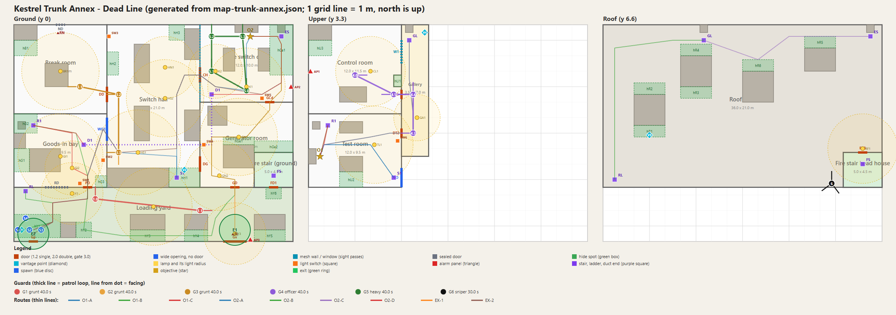

# Kestrel Trunk Annex - map design for "Dead Line"

Design only. No game code. Generated tables come from `map-trunk-annex.json` by `map-trunk-annex-render.mjs` (same script draws `map-trunk-annex.svg` and `.png`). Edit the JSON, then run `node docs/design/map-trunk-annex-render.mjs`; do not edit tables here by hand. Rules and sizes: `stealth-level-rules.md`, `scale-sheet.md`. Rule-by-rule evidence: `map-trunk-annex-validation.md`.

Coordinates: metres on a 0.5 m grid, x east, z north, origin at the centre of the site. Levels: Ground y 0, Upper y 3.3, Roof y 6.6. Build check: 12 doors, 17 lamps, 6 guards.

## a) Purpose

- **Site.** The Trunk Annex is a 1962 brick extension to the 1934 Kestrel Exchange. It holds the trunk switch that carries rented private lines, so it is where the broker's traffic physically passes. I chose it over the main exchange because it is small enough for 36 x 28 m, keeps the Kestrel premise and the Dead Line text, and has the three things light play needs: a double-height hall with a gallery, a roof, and a dark service yard.
- **Why the team is here.** Night Shift is hired by the Client (Alistair Crane, Continuity Office). He wants proof of who sells city call records before the blackout. A broker (Aldous Pell) rents a private line card, LC-4471, in the annex's core switch. The core switch is in a cage and is not on any network, so the tap must be clipped on by hand.
- **What the Client wants.** One thing: the tap on LC-4471. The circuit record in the Test room tells the team which card it is. The team must not be traced, so no kills and no alarm are the bonus goals.
- **Why guards are here.** Pell pays a private contractor (Halcyon Grid Services staff, who think they guard a telecoms asset). The contractor's night shift is six people.

## b) Security story and patrol logic

**Who hired whom.** Pell hired the contractor after a roof break-in two years ago, when a rival broker's crew photographed the cage. The contract names three things to protect: the core switch cage, the line-record cabinet, and the two entrances (the lane gate and the personnel door).

**What they expect.** A small theft or trace crew, on foot, at night, using the roof or the yard. Not a police raid. That is why the sniper covers the lane and the roof, and why a heavy sits in the cage.

**Systems that exist (all built from features the game has):**

| System | In the map | What it does |
| --- | --- | --- |
| Surveillance room | Control room (upper floor, desk, monitor wall, window onto the hall) | The officer watches the hall through the glass. **Cameras are PARKED:** the monitors show a static schematic. The "camera" is a guard at a window. |
| Alarm panels | AP1 control room, AP2 cage room, AP3 yard gate | A guard who has seen a person or a body runs to the nearest working panel within 30 m and holds it for 1.6 s (engine value). Three reinforcement grunts then arrive. |
| Perimeter lights | Circuit C1 (yard and roof security lights) | Sodium lamps, switchable, shootable. |
| Locked doors | Roller door RD and street door ND (sealed), vehicle gate Gv (chained), arrival gate Gp (padlock swapped by the team) | Sealed doors are walls for everyone. |
| Round checkpoints | The master clock | Every round is timed to the exchange's master clock. This is why all ground loops are 40 s and the sniper's is 30 s: the clock chimes (a tell) and each guard hits a checkpoint on it. Fixed, so learnable. |

**What an alarm does.** If AP1 or AP2 is rung, 3 reinforcement grunts enter by the north street door ND into the break room and sweep south through the hall. The yard stays quiet. If AP3 is rung they come through the vehicle gate Gv, which closes the van exit (E1). The player cannot disable a panel (not in the verb list); the player denies it by taking the runner down first or by being out of the 30 m range. The guard count on the map stays 6 for any number of players.

**Why each guard walks where they walk, solo or pair:**

- **G1 yard sentry (solo).** The contract names the gate and the personnel door. One man walks the yard line and checks the door lock and the gate chain. Solo because outdoors there is nobody to cover.
- **G2 and G3 pair, hall patrol.** The hall is the asset. After a past theft the contractor's rule is *no one patrols the hall alone*. They go in a pair, 2.5 s apart. **Their coverage gap:** on every loop both stand in the break room for about 6 s behind a closed double door, so the hall and the wide opening are unwatched (choke K2, windows below).
- **G4 officer, control room.** A duty officer logs the rounds, watches the hall through the window and works AP1. He walks the gallery to check the Test room door each loop because the records are the second most valuable thing.
- **G5 heavy, cage warden.** Stays in the cage room. A shotgun man because the threat is a theft crew. He rings AP2 only if he sees a person.
- **G6 sniper, roof overwatch.** Never moves. The lane and the roof are the only ways a vehicle or a roof team can come, and the previous break-in came over the roof. His 55 degree view covers the lane, then the yard, then the roof deck. He has a blind strip within 5 m of the south wall (the parapet hides the foot of the facade from him).

## c) Arrival and exfiltration

**Arrival.** The team's van drops them in Cooper's Lane south of the yard. Lantern's contact swapped the padlock on the pedestrian gate Gp the day before. The team steps into a drum-screened pocket at the yard's west end that is out of every guard's sight. Why this way: the lane is empty at night, the pocket is dark, and the gate is the contractor's own approved door (no cutting, no noise). *Story note:* the sample radio line in `story.md` section 8 says "in through the cable tunnel"; on this map the 1.3 m trench D1 is the cable tunnel and the way in is the lane gate. Michael to confirm.

**Exits compared:**

| Exit | Realism | Noise | Fit with the city blackout | Gameplay value | Verdict |
| --- | --- | --- | --- | --- | --- |
| Return to the start (gate Gp) | High: same way as in | Silent | Very good: dark lane | Low variance, but it is the safe fall-back | **Alternate E2** |
| Van at the vehicle gate Gv | High: the delivery lane has a gate | Low to medium (the gate chain, engine) | Good: no headlights needed | A final test across the lit yard under the sentry and the sniper | **Primary E1** |
| Helicopter on the roof | Low: a noisy, lit, traceable pickup in a city | Very loud | Poor: needs a lit pad, which the blackout removes | Roof is already the sniper's; a pickup would end every run on the roof | PARKED (a rooftop skyline moment for a later mission) |
| Utility tunnel to the lane | Good: exchanges have cable vaults | Quiet | Very good | Would be a second duct exit, a free skip of the yard, and a third walkable level (the roof is the link level) | Rejected for this map |

**How the player's actions change the trip out:**

- **Alarm at AP1 or AP2:** reinforcements come from the north (ND). The yard is quiet. E1 is still open but the hall is hunted: take the generator room (EX-1).
- **Alarm at AP3:** reinforcements at Gv. E1 is closed: go back by E2 through the hall and Goods-in (EX-2).
- **Bodies:** a found body sends the finder to the nearest panel (above). A hidden body (body spots in the hide table) does not.
- **Lights:** with C1 off the sniper cannot see the yard past 8 m, so the van run has 3 windows instead of 1 per 120 s; G1 spends 12 s searching at pole lamp Y2.
- **Route taken:** a player who came in by the roof can leave by the roof side and the fire stair into the yard east (FD1) without touching the hall.

## d) The gameplay loop

Watch the guards from a dark place, learn that their rounds repeat on the master clock, choose between a bold lit route, a quiet long one and a hidden one, act on a window or put a light out to make one, adapt when something changes, and run it again faster using what you found. First-time run: about 9 to 11 minutes (two to three loop-watches of 40 s each, three or four waits at chokes, two routes of about 30 to 45 s of walking). A known route: about 3 to 4 minutes (O1-C 18 s, O2-D 44 s or O2-A 27 s, EX-1 19 s plus short waits).

**Beat sheet**

| Beat | Time (first run) | The player sees | Decides | Learns |
| --- | --- | --- | --- | --- |
| 1 Arrive | 0:00 to 0:30 | Pocket, sodium pool Y1 on the wall, the sentry G1 pacing to the personnel door and back, the sniper's silhouette on the roof | Which spawn exit: ladder, door or south wall | Pools are danger, dark is safe; G1 pauses 4 s at the door and 4.8 s at the gate |
| 2 Observe | 0:30 to 2:30 | From V1 the sentry; from the roof AHU cover V3 the sniper; from the hall alcove V2 the pair; from the gallery V4 the heavy and the officer | Which route (stair, roof, riser) and when | The master clock: 40 s ground loops, 30 s sniper; the pair's break-room gap; the heavy's back-turned time |
| 3 Plan | 2:30 to 3:00 | The three O1 routes and their pools | Switch a circuit, shoot a lamp, or time it | Each switch has a cost (guard reaction in the circuit table) |
| 4 First move | 3:00 to 4:30 | Personnel door, then Goods-in with the riser ladder in the corner | PD window (K1) or the roof ladder | The door only matters at certain seconds |
| 5 Circuit record (O1) | 4:30 to 6:00 | Test room, cabinet in the dark with a lit sign, lit bench in the middle | Cross the lit bench or hug the wall; 3 s hold | The officer checks the door every 40 s; the record names LC-4471 |
| 6 Transition | 6:00 to 7:00 | Stair top over the hall, the cage across the mesh | Down the stair into the hall, back down the riser, or over the roof | The heavy's beat; three ways into the cage |
| 7 Tap (O2) | 7:00 to 9:00 | Cage racks, dark aisle, the core switch | Which aisle; when to hold 4 s | The heavy is back-turned for 20 s of 40 |
| 8 Exit | 9:00 to 10:30 | Yard, van lights off at the gate, sentry and sniper | Run on the one window, put out Y3/C1, or go back by Gp | The exit has a price that depends on what you did |

## e) Scale numbers

| Item | Value |
| --- | --- |
| Footprint per level | 36 x 28 m (yard included) |
| Walkable levels | Ground, Upper; roof deck as the link level |
| Main spaces | 8: Loading yard, Goods-in bay, Switch hall, Generator room, Core switch cage, Test room, Control room, Roof deck (plus break room, gallery, fire stair) |
| Corridors and lanes | hall west lane 3.5 m, hall south strip 3.5 m, hall centre lane 4.5 m, gallery 3.5 m, cage aisles 3.0 m, yard 7 m deep (south-wall lane behind the van and bins 1.5 m, a hide route only) |
| Doors | 12 total: 8 single 1.2 m, 3 double 2.0 m, 1 vehicle gate 3.0 m; plus 2 wide openings (3.0 and 2.5 m), 2 sealed doors, 1 mesh wall, 1 window |
| Stairs | 1 open feature stair (2.4 m, 30 deg, 20 risers) and 1 enclosed fire stair (1.3 m, 40 risers, 2 doors) |
| Ladders and shafts | 4 ladders (RL exterior, R1 riser, GL gallery-roof, ES exhaust) and 1 duct (D1 trench, 0.9 x 1.3, player only) |
| Guards | 6: 3 grunts (one solo, two as a pair), 1 officer, 1 heavy, 1 sniper |
| Lamps and circuits | 17 lamps on 6 circuits, 6 switches, 3 alarm panels |
| Hide spots and vantage points | 25 hide spots (9 body spots), 4 vantage points |

Door spacing and grid check (scale sheet sections 4 and 5):

| Door | Gap to the nearest wall corner m | Nearest door on the same wall (centre) m | Pass |
| --- | --- | --- | --- |
| Gp | 1.9 | 26.0 | pass |
| Gv | 6.0 | 26.0 | pass |
| PD | 1.9 | 19.0 | pass |
| GD | 3.9 | 5.0 | pass |
| FD1 | 1.9 | 5.0 | pass |
| DD | 1.5 | - | pass |
| DG | 2.0 | 11.5 | pass |
| CH | 2.5 | 11.5 | pass |
| GCd | 2.4 | - | pass |
| DT2 | 1.9 | 5.0 | pass |
| DC | 1.9 | 5.0 | pass |
| FD3 | 1.9 | - | pass |

| Door | Width m | Passes the 0.5 m nav grid (grid offset 0 and 0.25) |
| --- | --- | --- |
| Gp | 1.2 | NO / NO |
| Gv | 3 | NO / NO |
| PD | 1.2 | yes / yes |
| GD | 1.2 | yes / yes |
| FD1 | 1.2 | yes / yes |
| WO1 | 3 | yes / yes |
| DD | 2 | yes / yes |
| DG | 2 | yes / yes |
| CH | 2 | yes / yes |
| GCd | 1.2 | yes / yes |
| SO | 2.5 | NO / NO |
| DT2 | 1.2 | yes / yes |
| DC | 1.2 | yes / yes |
| FD3 | 1.2 | yes / yes |

## f) Floor plan

Grid: 0.5 m. Rects are `x0..x1`, `z0..z1`. Space "Gallery" is open to the hall (see-through rail on its east and south sides). The fire stair stands inside the generator room's south-east corner (carved out of it).

| Id | Space | Level | Kind | x range | z range | Size m | Ceiling | Landmark |
| --- | --- | --- | --- | --- | --- | --- | --- | --- |
| yard | Loading yard | G | outdoor | -18..18 | -14..-7 | 36.0 x 7.0 | open sky | sodium lamp pools, parked van, drum stacks |
| goods | Goods-in bay | G | main | -18..-6 | -7..2.5 | 12.0 x 9.5 | 3 | sealed roller door, pallets, forklift |
| brk | Break room | G | minor | -18..-6 | 2.5..14 | 12.0 x 11.5 | 3 | lockers, table, kettle, pinned rota |
| hall | Switch hall | G | main | -6..6 | -7..14 | 12.0 x 21.0 | 6 | rack rows, gallery above, open stair |
| gen | Generator room | G | main | 6..18 | -7..4 | 12.0 x 11.0 | 3 | genset, breaker board |
| fs | Fire stair (ground) | G | stair | 13..18 | -7..-2.5 | 5.0 x 4.5 | 3 | green exit sign |
| cage | Core switch cage | G | main | 6..18 | 4..14 | 12.0 x 10.0 | 6 | mesh wall, two rack rows, lit sign CORE |
| test | Test room | U | main | -18..-6 | -7..2.5 | 12.0 x 9.5 | 3 | test bench, line-record cabinet with lit sign |
| ctl | Control room | U | main | -18..-6 | 2.5..14 | 12.0 x 11.5 | 3 | monitor wall, glazed window onto the gallery |
| gal | Gallery | U | corridor | -6..-2.5 | -3..14 | 3.5 x 17.0 | 3 | rail over the hall, recess, ladder hatch |
| roof | Roof deck | R | main | -18..18 | -7..14 | 36.0 x 21.0 | open sky | AHU blocks, exhaust stack, parapet |
| fsR | Fire stair head house | R | stair | 13..18 | -7..-2.5 | 5.0 x 4.5 | 3 | green exit sign |

**Doors and openings**

| Id | Type | Level | Wall | Centre | Width m | From | To | Purpose |
| --- | --- | --- | --- | --- | --- | --- | --- | --- |
| Gp | door1 | G | z = -14 | x -15.5 | 1.2 | lane | yard | Arrival gate (padlock swapped by the team), alternate exit |
| Gv | gate | G | z = -14 | x 10.5 | 3 | lane | yard | Vehicle gate, primary extraction (van) |
| PD | door1 | G | z = -7 | x -8.5 | 1.2 | yard | goods | Personnel door, the way in |
| RD | sealed | G | z = -7 | x -12.5 | 3 | yard | goods | Sealed roller door, landmark |
| GD | door1 | G | z = -7 | x 10.5 | 1.2 | yard | gen | Generator service door |
| FD1 | door1 | G | z = -7 | x 15.5 | 1.2 | yard | fs | Fire door to the fire stair |
| WO1 | wide | G | x = -6 | z 0.5 | 3 | goods | hall | Wide opening, no door |
| DD | door2 | G | x = -6 | z 5 | 2 | brk | hall | Break room double door |
| DG | door2 | G | x = 6 | z -4 | 2 | hall | gen | Hall to generator room |
| CH | door2 | G | x = 6 | z 7.5 | 2 | hall | cage | Cage entrance in the mesh wall |
| MESH | mesh | G | x = 6 | z 9 | 10 | hall | cage | Mesh wall: sight and light pass, bodies do not |
| GCd | door1 | G | z = 4 | x 15 | 1.2 | gen | cage | Cage service door |
| ND | sealed | G | z = 14 | x -12 | 1.2 | brk | street | Sealed street door: reinforcement entry |
| SO | wide | U | x = -6 | z -5.75 | 2.5 | hall | test | Stair mouth into the Test room |
| DT2 | door1 | U | x = -6 | z 0 | 1.2 | gal | test | Test room gallery door |
| DC | door1 | U | x = -6 | z 5 | 1.2 | gal | ctl | Control room gallery door |
| W1 | window | U | x = -6 | z 10.5 | 3 | gal | ctl | Glazed window: the officer's view of the hall |
| FD3 | door1 | R | z = -2.5 | x 15.5 | 1.2 | fsR | roof | Roof door of the fire stair |

**Stairs, ladders, ducts**

| Id | Kind | From (level, x, z) | To (level, x, z) | Rise m | Travel m | Notes |
| --- | --- | --- | --- | --- | --- | --- |
| S1 | stairs-open | G 3, -5.75 | U -7, -5.75 | 3.3 | 9.5 | 2.4 wide, 20 risers 0.165 x 0.285 (slope 0.58), mid landing 2.0, along the hall's south wall, foot at the east end |
| FS | stairs-fire | G 15.5, -5.5 | R 15.5, -4 | 6.6 | 20 | enclosed 1.3 m flights, 40 risers, doors FD1 and FD3 |
| RL | ladder | G -16.5, -7.5 | R -16.5, -6 | 6.6 | 6.6 | exterior ladder on the south facade, 0.5 wide |
| R1 | ladder | G -15.5, 1 | U -15.5, 1 | 3.3 | 3.3 | cable riser, 1.0 x 1.0 shaft at x -17.5..-16.5, ladder reached from the east |
| GL | ladder | U -5, 12 | R -5, 12 | 3.3 | 3.3 | gallery to roof hatch, shaft 1.0 x 1.0 at x -5.5..-4.5, z 13..14 in the north-west corner of the gallery |
| ES | ladder | R 16.5, 12.5 | G 16.5, 12.5 | 6.6 | 7 | exhaust shaft: roof stack to the cage east aisle, 1.0 x 1.0, 6.6 m ladder |
| D1 | crawl | G -9, -1.5 | G 7.5, 5 | - | 23 | cable trench under the hall and the generator room, 0.9 wide x 1.3 high, grille T1 in the Goods-in bay, hatch T2 in the cage room |

**Corridors and lanes (width = short side; all at least 3.0 m)**

| Corridor or lane | Level | Rect | Width m | Length m |
| --- | --- | --- | --- | --- |
| west lane (hall) | G | -6,-4.5 - -2.5,14 | 3.5 | 18.5 |
| south strip (hall) | G | -6,-4.5 - 6,-1 | 3.5 | 12.0 |
| centre lane (hall) | G | -0.5,-1 - 4,14 | 4.5 | 15.0 |
| crossing channel (hall) | G | -2.5,3.5 - 6,6.5 | 3.0 | 8.5 |
| gallery | U | -6,-3 - -2.5,14 | 3.5 | 17.0 |
| west aisle (cage) | G | 6,4 - 9,14 | 3.0 | 10.0 |
| centre aisle (cage) | G | 10.5,4 - 13.5,14 | 3.0 | 10.0 |
| east aisle (cage) | G | 15,4 - 18,14 | 3.0 | 10.0 |
| yard (play space) | G | -18,-14 - 18,-7 | 7.0 | 36.0 |

## g) Asset audit

One row per door, stair, vent, shaft, window, light circuit, alarm panel, control room and guard post. Any row whose gameplay value could not be defended was deleted or moved during design (removed: roller-door gameplay, second fire-stair door, yard lamp Y4 and hall lamp HN2, the canteen, a south-yard drum stack that blocked the wall route).

| Id | Kind | What it is | Why it exists (story) | How it helps the game | How it could hurt | Mitigation |
| --- | --- | --- | --- | --- | --- | --- |
| Gp | door | Arrival gate Gp (1.2 m) | The team's way in: the contractor's padlock was swapped by the Client's contact. | A fixed, safe start and an alternate exit. | Players may think it is the only exit. | The radio names Gv as the van point. |
| Gv | door | Vehicle gate Gv (3.0 m) | The delivery lane. The van waits here. | The primary extraction, in view of the sentry and the sniper. | A wide gate can feel like a hole in the wall. | Closed until extraction; chained; the sentry checks it. |
| PD | door | Personnel door PD (1.2 m) | The night door staff use. | The main way in: 1 door to the whole ground floor. | Could be a free walk-in. | G1's door check and the sniper's yard facing give a timed window. |
| RD | door | Roller door RD (sealed, 3.0 m) | The delivery door, shuttered at night. | Reads the Goods-in bay from the yard; the landmark. | Players try to open it. | No handle, no prompt. |
| GD | door | Generator door GD (1.2 m) | Fuel deliveries and engineers use it. | A side route to the cage room that skips the hall. | Too close to the van: a free exit. | It sits in the sniper's blind strip but the 6 m yard hop to Gv is the exit test. |
| FD1 | door | Fire door FD1 (1.2 m) | The building's fire exit. | The route to the roof by the fire stair. | Door noise. | The stair ends 4 m from the sniper, so the cost is real. |
| WO1 | door | Wide opening WO1 (3.0 m) | Goods lorries bring racks into the hall. | Lets two players move together; no door fiddling. | Open sight line between the bay and the hall. | The hall side is under the gallery in shadow. |
| DD | door | Break-room double door DD (2.0 m) | The break room opens on the hall. | Gives the pair a visible pause: both go behind it for 6 s. | A hiding place that attracts the pair. | Reward is the dark body spot; the pair always comes out. |
| DG | door | Hall-to-generator double door DG (2.0 m) | Fuel and spares trolleys. | Links the hall to the board room for the co-op light trick. | Short-cuts the yard. | It is in the pair's south-junction view. |
| CH | door | Cage door CH (2.0 m) | Authorised entry to the core switch. | The fast, risky route into the heavy's room. | A fatal choke. | GCd, T2 and ES bypass it. |
| MESH | window | Mesh wall (x=6, z 4-14) | A security cage around the core equipment. | Sight and light pass: the heavy can be watched from the gallery. | The heavy sees you in the hall. | Hall's east side is rack-covered; the west lane under the gallery is dark. |
| GCd | door | Cage service door GCd (1.2 m) | Maintenance access for the switch engineers. | A slow, safe way to the dark east aisle. | Short exit route. | Its light switch SW5 is next to it: the player's choice. |
| ND | door | Street door ND (sealed) | The response car's door from the street. | Gives reinforcement an entry point so the alarm has a direction. | Players think it is an exit. | Barred; no prompt. |
| DT2 | door | Test door DT2 (1.2 m) | The records are behind a locked-by-habit door. | Gallery entry to O1; G4 checks it each loop. | Could be an easy O1 path. | The officer's check and the gallery risk. |
| DC | door | Control door DC (1.2 m) | The officer's door. | The officer's route is readable. | The player could go in. | The room is a dead end with a lit desk and AP1. |
| W1 | window | Control window W1 (3.0 m) | A glazed window so the officer can watch the hall. | The stationary narrow view; the player can read him from V4. | Unfair view into the gallery. | The desk is 6 m back; the gallery is in shadow. |
| SO | door | Stair mouth SO (2.5 m wide opening) | The stair top runs into the Test room. | Direct, no door. | Open to the hall below. | Rail and TL1's lamp are the risk. |
| FD3 | door | Roof door FD3 (1.2 m) | Roof access for plant maintenance. | The roof entry by the fire stair. | Next to the sniper. | The head house blocks his south-east view. |
| S1 | stair | Open stair S1 (2.4 m wide) | The engineers' main stair up to the test and control floor. | The main O1 route; a landmark; a lit, exposed climb. | Stuck in the hall. | The foot lobby hH1 is a dark pocket. |
| FS | stair | Fire stair FS (1.3 m) | The fire code requires a protected stair. | A quiet 20 s route to the roof for the team. | Dead time on a stair. | It is optional: RL is the alternative. |
| RL | ladder | Exterior ladder RL (0.5 m) | Roof access for riggers. | The first move from S1. | A ladder is slow and noisy. | It is out of the sniper's range (28 m). |
| R1 | shaft | Riser ladder R1 (1.0 x 1.0 shaft) | Cable riser from the Goods-in to the Test room. | A discoverable shortcut; skips the hall. | Could make O1 trivial. | Hidden behind the drums; the ladder is slow. |
| GL | shaft | Gallery-roof ladder GL (1.0 x 1.0 shaft) | Plant access from the gallery. | Links the roof with the gallery. | Lands in the officer's gallery. | The north end is 5 m from the recess. |
| ES | shaft | Exhaust shaft ES (1.0 x 1.0 shaft) | The cage's air exhaust stack. | The skilled drop-in: 4 m from O2, behind the racks. | Free if easy to reach. | Roof under the sniper; a 7 s helpless ladder. |
| D1 | vent | Cable trench D1 (0.9 x 1.3, player only) | Under-floor cable duct from the Goods-in to the cage. | A silent bypass of the hall and the door. | A free skip. | 23 m at 0.9 m/s is 26 s; grille T1 is in view from WO1; noise on entry; the hatch is lit. |
| T1 | vent | Grille T1 (Goods-in) | Cable trench cover. | The entry the player must discover. | Noise. | Entry rattles at a radius of 4 m. |
| T2 | vent | Hatch T2 (cage room) | The trench's service hatch. | Opens beside the cage door. | Next to the heavy's west aisle. | K2 lights it: the player pays to emerge. |
| C1 | circuit | Yard and roof lights C1 (5 lamps) | Perimeter security lighting. | Switching it off gives the yard to the player. | Free yard. | Sentry and sniper investigate. |
| C2 | circuit | Ground west C2 (3 lamps) | Goods-in and break-room lighting. | Darkens the way in and the riser. | Trivial. | The pair investigate. |
| C3 | circuit | Switch hall C3 (4 lamps) | The hall lights. | Makes the hall crossing possible. | Switch is on the far wall. | Pair and officer converge. |
| C4 | circuit | Generator room C4 (2 lamps) | Plant lighting. | The co-op breaker board. | Only useful with a partner. | Solo can shoot lamps. |
| C5 | circuit | Cage room C5 (2 lamps) | Lighting for the core switch. | Darkens the apron. | G5 reacts. | 8 s scan. |
| C6 | circuit | Upper floor C6 (3 lamps) | Test room, gallery and control room. | Darkens O1. | The officer is called. | 15 s search. |
| AP1 | panel | Alarm panel AP1 (control room) | The duty panel. | G4's 1-second response is a test. | Unavoidable alarm. | Takedown G4 first. |
| AP2 | panel | Alarm panel AP2 (cage room east wall) | Cage intrusion panel. | G5 has a goal. | The heavy rings it too fast. | He only rings it if he sees a person. |
| AP3 | panel | Alarm panel AP3 (yard) | Gate panel. | Reinforcements at the van. | Closes the primary exit. | Alternate exit E2. |
| CTL | room | Control room | The monitor room: the surveillance room. Cameras are PARKED, so the monitors show a static schematic. | A stationary watcher with a narrow view. | A dead end. | The officer leaves for the gallery. |
| GP1 | post | Guard post G1 (yard line) | The gate and the door. | Door check and gate check: two readable pauses. | Too visible. | Dark hides at 8 m. |
| GP2 | post | Guard posts G2/G3 (break room, south junction) | The hall patrol. | The pair's gap is the break. | Crowded. | 2.5 s offset. |
| GP4 | post | Guard post G4 (desk, Test door) | The officer's round. | A short walk and a long pause. | Locks the gallery. | Recess hU1. |
| GP5 | post | Guard post G5 (apron, west aisle, console) | The cage warden. | A rhythm with 18 s of back-turned time. | A hard fail. | East aisle is dark. |
| GP6 | post | Guard post G6 (roof parapet) | The overwatch. | A fixed narrow watcher over the yard. | Unfair kills. | A blind strip at the foot of the wall. |

## h) Spawn points

All four are in the dark pocket at the yard's west end, at least 1.2 m apart, none on a door. Each spawn sees the sentry G1 at his door check and the lit pool Y1; no guard can see a spawn in the first 90 s (validated by line-of-sight on the plan, see the validation file). First moves differ: ladder RL to the roof (S1), personnel door PD (S2), the south-wall run east (S3), waiting and watching (S4).

| Spawn | x | z | Nearest spawn m | First move | In shadow | Sees |
| --- | --- | --- | --- | --- | --- | --- |
| S1 | -17.5 | -12.5 | 1.5 | Climb the exterior ladder RL to the roof | yes | G1 G6 + a lit pool |
| S2 | -16 | -12.5 | 1.5 | Out through the gap to the personnel door PD | yes | G1 G6 + a lit pool |
| S3 | -14.5 | -12.5 | 1.5 | Along the south wall east behind the van (yard run) | yes | G1 G6 + a lit pool |
| S4 | -16.5 | -11 | 1.6 | Wait at the pocket mouth and watch the sentry | yes | G1 + a lit pool |

## i) Objectives and exits

| Objective | Level | x | z | Hold | Space | Nearest lamp (m / radius) | Light | Why this order |
| --- | --- | --- | --- | --- | --- | --- | --- | --- |
| O1 Pull the circuit record | U | -16.5 | -3 | 3 s | test | TL1: 7.2 / 5 | dark | Names the broker's line card LC-4471. Without it the tap has nothing to clip to. |
| O2 Plant the tap | G | 12.5 | 12.5 | 4 s | cage | K2: 6.4 / 3.5 | dark | Clip the tap onto line card LC-4471 in the core switch. |

**Why this order.** O1 gives the card number LC-4471; the tap needs it. O1 is on the upper floor, so the player also gets the gallery view of the hall before the harder O2. O2 is last because the cage is the heaviest room. Both sites are in shadow; the shortest path to each crosses at least one lit pool (validation, rule 13).

| Exit | x | z | Radius |
| --- | --- | --- | --- |
| E1 Van at the vehicle gate (primary) | 10.5 | -12.5 | 2 |
| E2 Back out the arrival gate (alternate) | -15.5 | -13 | 2 |

## j) Guard sheets

All loops are literal and deterministic. Dwell time includes a 0.5 s turn per waypoint (engine feel value used in the sheets). "Phase" shifts the loop start so that the windows line up the same on every run.

| Guard | Archetype | Speed m/s | Path m | Loop s | Phase s |
| --- | --- | --- | --- | --- | --- |
| G1 | grunt | 0.9 | 27.2 | 40.0 | 0 |
| G2 | grunt | 0.9 | 25.2 | 40.0 | 8 |
| G3 | grunt | 0.9 | 25.2 | 40.0 | 10.5 |
| G4 | officer | 0.85 | 26.2 | 40.0 | 20 |
| G5 | heavy | 0.75 | 20.7 | 40.0 | 3 |
| G6 | sniper | 0.85 | 0.0 | 30.0 | 28.5 |

#### G1 grunt - Yard sentry (solo)

Start: waypoint 0 at (-7.5, -8.5); phase 0 s; speed 0.9 m/s; loop 40.0 s over 27.2 m of path.

Why here: The contract names the yard gate and the personnel door as the two ways in. One man walks the line.

| Wp | x, z | Dwell s | Facing | What | Arrives (loop s) |
| --- | --- | --- | --- | --- | --- |
| 0 | -7.5, -8.5 | 4.0 | 0,1 | door check at PD | 0.0 |
| 1 | 6, -10 | 4.8 | 1,0 | checks the gate chain | 19.6 |

Tells: boots on gravel, audible 6 s before each leg ends; torch beam sweeps the wall 3 s before he turns at the door.

Lights out: C1 off: goes to Y2 and searches 12 s, then resumes. Body found: stops, calls it, runs to AP3 (alarm), 3 reinforcements at the lane.

#### G2 grunt - Pair lead, hall patrol

Start: waypoint 0 at (-4.5, 5); phase 8 s; speed 0.9 m/s; loop 40.0 s over 25.2 m of path.

Why here: The hall is the asset (relay racks). After a past theft the contractor ordered no one patrols the hall alone: a pair.

| Wp | x, z | Dwell s | Facing | What | Arrives (loop s) |
| --- | --- | --- | --- | --- | --- |
| 0 | -4.5, 5 | 0.0 | -1,0 | break-room door | 0.0 |
| 1 | -9.5, 6 | 6.0 | -1,0 | break room, kettle, backs to the hall | 6.2 |
| 2 | -4.5, 5 | 0.0 | 0,-1 | leaves the break room | 18.3 |
| 3 | -4.5, -2.5 | 4.0 | 0,-1 | south junction, looks at the wide opening and stair | 27.2 |

Tells: radio crackle and two voices in the break room, 4 s before they come out; door slap of the double door DD, 2 s before they appear.

Lights out: C3 off: both go to the hall centre, 15 s search. C4 off: they walk to the board. Body found: G2 runs to AP2 or AP1 (nearest), G3 guards the body.

#### G3 grunt - Pair trail, 2.5 s behind G2

Start: waypoint 0 at (-4.5, 5); phase 10.5 s; speed 0.9 m/s; loop 40.0 s over 25.2 m of path.

Why here: Second man of the pair; trails so the pair never stand on top of each other.

| Wp | x, z | Dwell s | Facing | What | Arrives (loop s) |
| --- | --- | --- | --- | --- | --- |
| 0 | -4.5, 5 | 0.0 | -1,0 | break-room door | 0.0 |
| 1 | -9.5, 6 | 6.0 | -1,0 | break room | 6.2 |
| 2 | -4.5, 5 | 0.0 | 0,-1 | leaves the break room | 18.3 |
| 3 | -4.5, -2.5 | 4.0 | -1,0 | south junction, covers the west side | 27.2 |

Tells: radio crackle in the break room, 2.5 s after G2's; DD slap, 2.5 s after G2's.

Lights out: as G2. Body found: as G2.

#### G4 officer - Control room officer

Start: waypoint 0 at (-12, 7.5); phase 20 s; speed 0.85 m/s; loop 40.0 s over 26.2 m of path.

Why here: The contract needs a duty officer who logs the rounds, watches the monitors and works the alarm panel. The records are the second most valuable thing, so he checks that door.

| Wp | x, z | Dwell s | Facing | What | Arrives (loop s) |
| --- | --- | --- | --- | --- | --- |
| 0 | -12, 7.5 | 3.2 | 1,0 | desk, watches the hall through the window | 0.0 |
| 1 | -7, 5 | 0.0 | 1,0 | control room door | 10.3 |
| 2 | -4.5, 5 | 0.0 | 0,-1 | gallery | 13.7 |
| 3 | -4.5, 0 | 3.0 | -1,0 | checks the Test room door | 20.1 |
| 4 | -4.5, 5 | 0.0 | 0,1 | gallery, going back | 29.5 |
| 5 | -7, 5 | 0.0 | -1,0 | control room door | 32.9 |

Tells: keys on his belt, 2 s before he opens DC; CL1 lamp flickers on the window glass 3 s before he stands.

Lights out: C6 off: leaves the desk, checks the Test door and the gallery 15 s. Body found: runs to AP1 at once, then orders a search.

#### G5 heavy - Cage warden

Start: waypoint 0 at (12, 5.5); phase 3 s; speed 0.75 m/s; loop 40.0 s over 20.7 m of path.

Why here: The cage is what the broker protects: the core switch holds his private line card. A heavy with a shotgun because the threat is a theft crew, not a trespasser.

| Wp | x, z | Dwell s | Facing | What | Arrives (loop s) |
| --- | --- | --- | --- | --- | --- |
| 0 | 12, 5.5 | 3.4 | 0,1 | apron, looks up the centre aisle | 0.0 |
| 1 | 7.5, 8 | 0.0 | 0,1 | west aisle | 10.8 |
| 2 | 7.5, 12.5 | 3.0 | 0,1 | north-west corner | 17.3 |
| 3 | 11.5, 12.5 | 4.0 | 0,1 | console check, back to the aisle mouth | 26.1 |

Tells: heavy tread and armour clink through the mesh, 4 s before he reaches the apron; his shadow swings across the K1 pool on the apron 2 s before he arrives.

Lights out: C5 off: stops and scans 8 s, then resumes. Body found: does not leave the cage: stands at AP2, rings it.

#### G6 sniper - Roof overwatch (stationary)

Start: waypoint 0 at (11.5, -6.5); phase 28.5 s; speed 0.85 m/s; loop 30.0 s over 0.0 m of path.

Why here: The only way a vehicle or a roof team can reach the building is the lane and the roof. A previous break-in came over the roof.

| Wp | x, z | Dwell s | Facing | What | Arrives (loop s) |
| --- | --- | --- | --- | --- | --- |
| 0 | 11.5, -6.5 | 12.0 | 0.6,-0.8 | lane and vehicle gate | 0.0 |
| 1 | 11.5, -6.5 | 10.0 | -0.8,-0.6 | yard and the personnel door | 12.5 |
| 2 | 11.5, -6.5 | 6.5 | 0,1 | roof deck north | 23.0 |

Tells: the scope glints in the sodium light 2 s before each turn; boot scrape on the roof gravel 3 s before each turn.

Lights out: C1 off: stays on the yard facing 10 s then sweeps. Body found: does not leave the roof; reports by radio, AP not used.

**Safe windows created** (over the 120 s cycle that every loop divides into). Windows are the seconds in which none of the listed guards can see the choke. "Lights out" re-computes with sentry-and-sniper far views removed (a dark body is only seen inside 8 m; engine assumption).

| Choke | Where | Need s | Seen by | Safe windows in the 120 s cycle, lit (start-end, length) | Windows >= need | Worst wait s | Lights out: windows, worst wait s |
| --- | --- | --- | --- | --- | --- | --- | --- |
| K1 Personnel door PD | G -8.5, -7 | 3 | G1 G6 | 6.5-11.0 (4.5 s); 21.5-24.9 (3.4 s); 51.5-64.9 (13.4 s); 86.5-101.0 (14.5 s) | 4 | 29.5 | 3, 24.5 |
| K2 Hall south crossing | G -4, -3 | 3 | G2 G3 | 4.2-26.8 (22.7 s); 44.2-66.8 (22.7 s); 84.2-106.8 (22.7 s) | 3 | 20.2 | 3, 20.2 |
| K3 Gallery south (recess to Test door) | U -4.5, 4 | 3 | G4 | 12.9-30.8 (17.9 s); 52.9-70.8 (17.9 s); 92.9-110.8 (17.9 s) | 3 | 24.9 | 3, 24.9 |
| K4 Cage door CH and apron | G 8, 6 | 3 | G5 | 13.8-33.6 (19.8 s); 53.7-73.6 (19.8 s); 93.7-113.5 (19.8 s) | 3 | 23.0 | 3, 23.0 |
| K5 Console approach (O2 hold 4 s) | G 12.5, 12.5 | 4 | G5 | 113.5-3.0 (9.5 s); 6.9-14.3 (7.4 s); 33.6-43.0 (9.4 s); 46.9-54.2 (7.4 s); 73.6-82.9 (9.4 s); 86.8-94.2 (7.4 s) | 6 | 23.3 | 6, 23.3 |
| K9 Centre aisle run (route O2-A) | G 12, 9 | 5 | G5 | 7.9-20.3 (12.4 s); 47.9-60.2 (12.4 s); 87.8-100.2 (12.4 s) | 3 | 32.7 | 3, 32.7 |
| K6 Yard east crossing to GD and Gv | G 8, -9 | 3 | G1 G6 | 111.5-118.5 (7.0 s) | 1 | 115.8 | 3, 24.4 |
| K7 Roof east, stack to ES | R 14, 12 | 3 | G6 | 118.5-21.5 (23.0 s); 28.5-51.5 (23.0 s); 58.5-81.5 (23.0 s); 88.5-111.5 (23.0 s) | 4 | 9.8 | 4, 9.8 |
| K8 Test room lit crossing | U -9.5, -1.5 | 3 | G4 | 84.6-0.1 (35.5 s); 4.6-40.1 (35.5 s); 44.6-80.1 (35.5 s) | 3 | 7.4 | 3, 7.4 |

Guard to window: G1 opens K1 and K6; G2 and G3 open K2 (the pair gap); G4 opens K3 and K8; G5 opens K4, K5 and K9; G6 opens K1, K6 and K7.

## k) Light plan

| Lamp | Circuit | Level | x | z | Height | Radius | Shootable | Where |
| --- | --- | --- | --- | --- | --- | --- | --- | --- |
| Y1 | C1 | G | -10.5 | -7.8 | 3.2 | 4 | yes | over the personnel door |
| Y2 | C1 | G | 0 | -9.5 | 5 | 5 | yes | pole lamp, yard centre |
| Y3 | C1 | G | 10.5 | -13 | 4 | 4 | yes | over the vehicle gate |
| RF1 | C1 | R | 15.5 | -2 | 3 | 4.5 | yes | security light on the head house |
| GI1 | C2 | G | -12 | -3 | 2.8 | 5.5 | yes | over the work area |
| GI2 | C2 | G | -10.5 | -4.5 | 2.8 | 3.5 | yes | inside the personnel door, over the work bench |
| BR1 | C2 | G | -12 | 8 | 2.8 | 5 | yes | break room |
| HS1 | C3 | G | -2 | -2.5 | 5 | 5.5 | yes | south strip and wide opening |
| HS2 | C3 | G | 1.5 | 4.5 | 5 | 5 | yes | crossing channel |
| HN1 | C3 | G | 1.5 | 8.5 | 5 | 4 | yes | north lane and the cage door |
| GN1 | C4 | G | 11 | -0.5 | 3 | 5 | yes | over the genset |
| GN2 | C4 | G | 8.5 | -5.5 | 3 | 4.5 | yes | over the yard door and hall door |
| K1 | C5 | G | 12 | 6 | 4.5 | 5 | yes | south apron of the cage room |
| K2 | C5 | G | 8 | 8 | 4.5 | 3.5 | yes | west aisle, over the hatch T2 |
| TL1 | C6 | U | -9.5 | -1.5 | 2.8 | 5 | yes | over the test bench |
| GA1 | C6 | U | -4 | 2 | 2.8 | 3 | yes | gallery south, by the Test door |
| CL1 | C6 | U | -10 | 8 | 2.8 | 4.5 | yes | desk lamp |

| Circuit | Lamps | Switch | Switch position | Guard reaction (and duration) |
| --- | --- | --- | --- | --- |
| C1 Yard and roof security lights | Y1 Y2 Y3 RF1 | SW1 | G -9.5, -6.5: by the personnel door, inside | G1 walks to pole lamp Y2 and searches 12 s with a torch; G6 holds on the yard 10 s. A shot lamp: G1 goes to that lamp, 8 s. |
| C2 Ground west (Goods-in, break room) | GI1 GI2 BR1 | SW2 | G -6.5, -3.5: on the east wall south of the wide opening, hidden from the hall | Pair breaks the loop at the next waypoint, walks to the dark room, searches 10 s, resumes. |
| C3 Switch hall | HS1 HS2 HN1 | SW3 | G -5.75, 12.5: hall north-west wall, under the gallery | Pair and G4 converge on the hall centre, 15 s search; G5 turns to face the mesh 6 s. |
| C4 Generator room | GN1 GN2 | SW4 | G 6.5, -1.5: breaker board BP, west wall of the generator room | Pair detours to the board 12 s (the only circuit they walk to), then resume. Nobody re-lights it. |
| C5 Cage room | K1 K2 | SW5 | G 14, 4.5: inside the cage room, beside the service door GCd | G5 stops, scans 8 s, goes to AP2 only if he sees a person. Pair investigates after 15 s. |
| C6 Upper floor (Test room, gallery, control room) | TL1 GA1 CL1 | SW6 | U -6.5, -1: Test room east wall, next to the gallery door | G4 leaves the desk, checks the Test room door and the gallery 15 s with a torch. |

Which lamps can be shot: every lamp is shootable; shooting one is heard (shot noise) and the nearest guard goes to that lamp for 8 s. Switches are physical and only on the walls listed. The sign decals for CORE and LINE RECORDS are tuned in build step 2 so they do not lift the objective above the shadow threshold (0.28).

| Panel | Level | x | z | Where | Reinforcements arrive at |
| --- | --- | --- | --- | --- | --- |
| AP1 | U | -17.75 | 8 | officer's panel, west wall of the control room | North street door (ND, sealed to the player) (-12, 13) |
| AP2 | G | 17.75 | 6 | east wall of the cage room, on the aisle mouth | North street door (ND, sealed to the player) (-12, 13) |
| AP3 | G | 12.5 | -13.75 | yard wall beside the vehicle gate | Vehicle gate Gv (10.5, -13) |

## l) Hide spots and vantage points

| Id | Level | Rect x0,z0 - x1,z1 | W x D x H m | Opens | Enclosure | Body spot | Shows |
| --- | --- | --- | --- | --- | --- | --- | --- |
| hY1 | G | -18,-13.5 - -12,-10.5 | 6.0 x 3.0 x 1.8 | N | DS1 on the east (south half), walls south and west; dark, 8 m or more from the sentry | yes | G1 |
| hY2 | G | -10,-13.5 - -8,-11.5 | 2.0 x 2.0 x 1.8 | N | DS1 west, wall south (behind the sentry while he checks the door) |  | G1 |
| hY3 | G | -3,-14 - 1.5,-12.5 | 4.5 x 1.5 x 2.0 | E | van north, wall south | yes | - |
| hY4 | G | 4,-14 - 7,-12.5 | 3.0 x 1.5 x 1.4 | W | bins north, wall south (1.4 m: crouch) |  | G1 |
| hY5 | G | 13,-14 - 17,-12.5 | 4.0 x 1.5 x 1.5 | W | pallets north, wall south (1.5 m) | yes | - |
| hY6 | G | 14.5,-8.5 - 16.5,-7 | 2.0 x 1.5 x 2.0 | S | porch walls at the fire door |  | - |
| hG1 | G | -18,-5 - -16,-2 | 3.0 x 2.0 x 1.6 | N | pallets east, wall west | yes | - |
| hG3 | G | -7.5,-7 - -6,-5.5 | 1.5 x 1.5 x 1.8 | N | crate bay: east wall, south wall beside PD, a crate on the west |  | - |
| hG2 | G | -18,0 - -15,2.5 | 3.0 x 2.5 x 1.8 | E | drum rack south, walls north and west, riser shaft R1 inside |  | - |
| hH1 | G | 2,-7 - 6,-4.5 | 4.0 x 2.5 x 2.0 | N | stair block west, walls south and east |  | G2 G3 |
| hH2 | G | -6,7.5 - -4.5,10.5 | 3.0 x 1.5 x 2.0 | E | cabinet bay in the west wall, under the gallery |  | - |
| hH3 | G | 2,12 - 4,14 | 2.0 x 2.0 x 2.0 | W | racks east, north wall |  | - |
| hB1 | G | -18,10 - -15,12 | 3.0 x 2.0 x 1.9 | S | lockers north, walls | yes | - |
| hGe1 | G | 9,-1.5 - 13,-0.5 | 4.0 x 1.0 x 2.0 | N | genset south, tank alcove | yes | - |
| hGe2 | G | 13,-2.5 - 18,-1 | 5.0 x 1.5 x 2.0 | N | fire stair wall south |  | - |
| hCa1 | G | 15,7.5 - 18,14 | 6.5 x 3.0 x 2.2 | S | racks CR2 west, walls north and east | yes | - |
| hU1 | U | -7,6 - -6,7.5 | 1.5 x 1.0 x 2.2 | E | recess cut into the control room wall |  | - |
| hU2 | U | -14,-7 - -11,-5 | 3.0 x 2.0 x 1.9 | W | bench north, wall south |  | - |
| hU3 | U | -18,10 - -15,12 | 3.0 x 2.0 x 1.9 | S | filing north, walls | yes | - |
| hR1 | R | -14,-0.5 - -10,1 | 4.0 x 1.5 x 2.5 | S | AHU north, parapet-free roof, 1.0 m kerb | yes | - |
| hR2 | R | -14,5 - -10,6.5 | 4.0 x 1.5 x 2.5 | N | AHU south |  | - |
| hR3 | R | -8,4.5 - -4,6 | 4.0 x 1.5 x 2.5 | S | AHU north |  | - |
| hR4 | R | -8,10 - -4,11.5 | 4.0 x 1.5 x 2.5 | N | AHU south, hatch housing east |  | - |
| hR5 | R | 8,11 - 12,12.5 | 4.0 x 1.5 x 2.5 | N | chiller south: out of the sniper's line |  | - |
| hR6 | R | 0,8 - 4,9.5 | 4.0 x 1.5 x 2.5 | N | AHU south |  | - |

| Id | Level | x | z | Dark | Shows | Distance to the guard path | Angle off the guard facing |
| --- | --- | --- | --- | --- | --- | --- | --- |
| V1 | G | -17 | -12.5 | yes | G1: door check at A and the Y1 pool, from deep in the pocket through the gap | 10.3 m | 113 deg |
| V2 | G | 4 | -4.75 | yes | G2: pair at the south junction | 8.8 m | 75 deg |
| V2 | G | 4 | -4.75 | yes | G3: pair at the south junction | 8.8 m | 165 deg |
| V2 | G | 4 | -4.75 | yes | G4: officer's door check on the gallery, through the void | 10.3 m | 151 deg |
| V3 | R | -12 | -0.25 | yes | G6: sniper on the lane facing, 24 m away | 24.3 m | 142 deg |
| V4 | U | -3 | 13 | yes | G4: officer at the desk through the window | 8.1 m | 31 deg |
| V4 | U | -3 | 13 | yes | G5: heavy across the mesh, from above the racks | 11.0 m | 65 deg |

## m) Routes

Three routes per objective (A, B, C; O2 also has a trench variant D). They share at most 30 percent of their length (the first 6 m and the last 6 m are excluded, since every route starts at a spawn and ends on the objective). Times: walk at 2.0 m/s, stairs 1.6, ladders 1.0, crawl 0.9; waits are the worst case for a player who does not know the windows.

**O1**

| Route | Kind | Hops | Chokes | Walk m | Time s | Worst waits s | Risk | Teaches |
| --- | --- | --- | --- | --- | --- | --- | --- | --- |
| O1-A Stair route | main | walk > stairs S1 > walk | K1 K2 K8 | 45.7 | 29 | 57 | medium-high: lit crossing in view of the pair | The hall is the pair's room. Read the junction, cross while they sit in the break room. |
| O1-B Roof and gallery | slow-safe | walk > ladder RL > walk > ladder GL > walk | K3 K8 | 65.0 | 42 | 32 | medium: the officer's gallery round | Quiet, long, and the officer owns the gallery. Shadow and the recess carry you. |
| O1-C Riser ladder (hidden) | hidden | walk > ladder R1 > walk | K1 | 28.7 | 18 | 30 | low once found | A way up that skips the hall. Found by looking in the Goods-in corner. |

**O2**

| Route | Kind | Hops | Chokes | Walk m | Time s | Worst waits s | Risk | Teaches |
| --- | --- | --- | --- | --- | --- | --- | --- | --- |
| O2-A Hall and cage door | main | walk > stairs S1 > walk | K2 K4 K9 K5 | 41.9 | 27 | 99 | high: apron and aisle are the heavy's beat | Fast and bold: through the heavy's door, up his own aisle in the dark between the racks. |
| O2-B Yard and generator room | slow-safe | walk > ladder R1 > walk | K1 K6 K5 | 78.1 | 42 | 169 | medium: yard crossing under the sniper | Use the south wall shadow, time the yard hop, then take the dark east aisle. |
| O2-C Roof and exhaust shaft | skilled | walk > ladder GL > walk > ladder ES > walk | K3 K7 K5 | 52.2 | 36 | 58 | medium-high: roof under the sniper, helpless on the shaft | Drop in behind the racks. Costs a ladder you cannot fight on and a roof the sniper watches. |
| O2-D Trench variant (bypasses CH and hall) | hidden | walk > ladder R1 > walk > crawl D1 > walk | K4 K5 | 30.5 | 44 | 46 | medium: grille seen from the wide opening, noise on entry, apron on exit | A silent 23 m crawl under the hall. The hatch opens on the lit apron. |

**Exit**

| Route | Kind | Hops | Chokes | Walk m | Time s | Worst waits s | Risk | Teaches |
| --- | --- | --- | --- | --- | --- | --- | --- | --- |
| EX-1 Generator room to the van (primary) | main | walk | K6 | 37.4 | 19 | 116 | medium at the yard hop | A calm walk with one test: the last 6 m of open yard under both the sentry and the sniper. |
| EX-2 Hall, Goods-in and the arrival gate (alternate) | slow-safe | walk | K4 K2 K1 | 63.2 | 32 | 73 | medium: the hall again | Back the way you came: the quiet exit when the east yard is hot. |

## n) Exploration rewards

| Reward | Where | What it unlocks | How the player learns it | Saves on a second run |
| --- | --- | --- | --- | --- |
| X1 The riser ladder R1 | Goods-in north-west corner, behind the pallets (-15.5, 1.0) | A way into the Test room that skips the hall, the stair and the pair. O1 in about 20 s. | A ladder foot shows in the Goods-in corner from the wide opening; a pinned cable chart in the break room names 'RISER 1'. | 39 s (O1-A 86 s vs O1-C 47 s; walk plus worst-case waits; walk alone 11 s) |
| X2 The cable trench D1 | Grille T1 in the Goods-in bay (-9.0, -1.5) | A silent 23 m crawl under the hall and the generator room to the cage room. Skips the hall, CH and the pair. | The grille is visible from the wide opening; a cable-pit label and a draught that moves the dust. Cost: 26 s crawl, noise on entry. | 36 s (O2-A 126 s vs O2-D 90 s; walk plus worst-case waits; walk alone -17 s) |
| X3 The exhaust shaft ES | Roof stack at (16.5, 13.5) | A drop into the cage's dark east aisle behind the racks, 4 m from O2. | The stack is visible from the AHU cover on the roof, and the cage's east aisle shows a hatch grille when seen from the apron. | 32 s (O2-A 126 s vs O2-C 94 s; walk plus worst-case waits; walk alone -10 s) |

## o) Co-op and solo

| Id | Co-op opportunity | Solo alternative | Gain |
| --- | --- | --- | --- |
| CO1 | One player at breaker board BP (SW4) kills C4 and a partner crosses the generator room | Shoot Y/GN lamps from cover (noise radius), or go the long way via the south wall | Quiet dark, no shot |
| CO2 | A spotter on gallery V4 pings the pair and the heavy; a runner uses the call | Spend one guard loop (40 s) at V4, then go | Skips the first-loop wait |
| CO3 | One player pulls O1 while another waits in the east aisle for O2 | Do O1, then O2 in order (O1 gives the card number) | About 90 s saved; no waiting for each other |
| CO4 | One player takes down G2, another drags and hides the body at hGe1 | Takedown, drag it 8 m yourself, 10 s slower | Hides faster |
| CO5 | Two players at the break-room double door DD: one pings the pair's timing, one slips past | Wait for the pair to be inside (6 s) | A fixed 6 s safe slot |
| CO6 | A partner down in the cage room east aisle (hCa1) is revived by another coming down ES | Not needed: no revive in solo | A rescue route that is out of the heavy's view |
| CO7 | Four players enter by four different routes at once (RL, PD, south wall, trench) and meet in the east aisle | One route per run | No queue at any door: the ladder, the wide opening and the yard are separate |

**Four players spread:** P1 takes the riser R1 to O1. P2 goes up RL and over the roof to the exhaust shaft ES. P3 takes the trench D1 from Goods-in. P4 runs the south wall to the generator door and the east aisle. All four meet in the cage east aisle, 4 m from O2. No door is a queue: the ladders, the 3.0 m wide opening and the yard are separate. Any player can do O2 once any player did O1.

## p) Build plan (three Sonnet steps)

Common: the map data is `docs/design/map-trunk-annex.json`. Copy it to `src/world/maps/trunkAnnex.data.json` and have the builder read it, so the design file and the game cannot drift. Nothing here changes the player, nav, AI or camera code. Hand check on Michael's PC with `npm run dev`, `/?autostart=trunk-annex&mode=infiltration`.

### T1 - Trunk Annex: walkable greybox with guards (Sonnet)
**Goal.** The whole map walkable in greybox with the six guards patrolling, so the loop can be tested in one session.
**Read.** `docs/design/map-trunk-annex.md` sections e, f, j; `map-trunk-annex.json` (spaces, blocks, openings, links, guards); `docs/design/scale-sheet.md` section 4; `src/world/maps/exchange.ts` (how a map is registered); grep `src/world/levelBuilder.ts` for `box`, `room`, `door`, `stair`, `ladder`; `src/ai/patrol.ts`; `src/ai/navBuild.ts`.
**Files.** `src/world/maps/trunkAnnex.ts`, `src/world/maps/trunkAnnex.data.json`, `src/world/maps/index.ts`, `tests/trunkAnnexMap.test.ts`, `scripts/e2e-fp-trunk.mjs`, `docs/progress.md`, `CHANGELOG.md`.
**Do.** Build every space, block, opening (door sizes exactly as listed, centres on the 0.5 m grid), open stair S1, fire stair FS, ladders RL, R1, GL, ES, and the 6 guards from the JSON with their loops. Greybox only. Sealed doors are walls. Do not build D1 yet.
**Acceptance.**
1. Unit test: for every opening of type door1, door2, wide or gate, the cells on both sides are connected on the 0.5 m nav grid, **and** a 1.2 m door at an odd centre (for example x = 12.3) is reachable from both sides.
2. Unit test: every space centre, both objectives, both exits and all four spawns are reachable from spawn 2 (D1 excluded; ES, GL, R1, RL, S1, FS included).
3. Unit test: every corridor and lane in the JSON `corridors` list is at least 3.0 m wide on the nav grid (short side), and no walkable cell is closer than 0.32 m to a wall.
4. Unit test: every guard waypoint is a walkable cell, every leg between waypoints is walkable on the grid, and the computed loop period is 40 s (30 s for G6) within 0.3 s.
5. Unit test: no door within 1.5 m of a wall corner and 3.0 m between door centres on one wall (the generated door-spacing table).
6. `?autostart=trunk-annex&mode=sandbox&fullbright=1` boots with 0 console errors, 6 guards spawn and move.
7. `npm run check` and `e2e:quick` pass (known-flaky suites excepted).
**Smoke.** `e2e-fp-trunk`: boot, teleport to each space, confirm each guard has moved after 10 s.
**Hand check.** Walk spawn to PD to the stair and up; take the riser; climb RL and cross the roof; ride ES down. Watch G1, the pair and the heavy loop. Is every lane roomy for the camera?

### T2 - Trunk Annex: lights, switches, panels, hide spots, objectives, extraction (Sonnet)
**Goal.** The map is a mission: lit pools and dark, six switches, three alarm panels, objectives O1 then O2, two exits.
**Read.** `map-trunk-annex.md` sections i, k, l; `src/game/missions.ts`; `src/game/modes/infiltrationMode.ts`; `src/world/lights.ts`; `src/game/stealthSystems.ts`; the T1 map file.
**Files.** `src/world/maps/trunkAnnex.ts`, `src/game/missions.ts`, `tests/trunkAnnexMap.test.ts`, `scripts/e2e-fp-trunk.mjs`.
**Do.** Lamps and circuits exactly as the JSON (positions, heights, radii), ambient zones 0.08 to 0.12 indoors and 0.15 in the yard, six wall switches, three alarm panels with the two reinforcement points, hide spots as three-sided prop bays, four spawn points, objectives O1 (3 s hold at the line-record cabinet) and O2 (4 s hold at the core switch), extraction E1 and E2 (radius 2). Add one mission entry `trunk-annex` (do not touch `exchange-greybox`). Rules `noAlarms`, `noKills`, `undetected` stay `bonus`.
**Acceptance.**
1. Unit test: both objective sites are below `LIGHT.shadow` (0.28) on the light field; the first lit cell on each of the O1 and O2 routes A is above `LIGHT.lit` or at least above `LIGHT.shadow`.
2. Unit test: every hide spot cell is below `LIGHT.shadow` and meets 1.2 x 1.0 x 1.2 m.
3. Unit test: each switch turns exactly its circuit off; shooting a lamp removes only that lamp.
4. Unit test: both objectives and both extractions are reachable from every spawn.
5. Headless run completes O1, O2 and E1 in order and the mission reports complete.
6. `npm run check` and `e2e:quick` pass.
**Smoke.** Extend `e2e-fp-trunk` with step 5.
**Hand check.** Play solo from the pocket to the van once. Are the pools readable? Is there a dark way past each guard? Where do you wait?

### T3 - Trunk Annex: trench duct D1, rewards, and the 120 s window test (Sonnet)
**Goal.** The player-only trench D1, the discoverable shortcuts, and a test that the guard windows match the design.
**Read.** `map-trunk-annex.md` sections g (rows T1, T2, D1), m, n; `map-trunk-annex.json` (links D1, chokes); the crouch clearance in `src/player`.
**Files.** `src/world/maps/trunkAnnex.ts`, `tests/trunkAnnexMap.test.ts`, `scripts/e2e-fp-trunk.mjs`, `docs/progress.md`, `CHANGELOG.md`, `TESTING.md`.
**Do.** Measure crouch clearance first (clear height = crouch height + 0.15 m, minimum 1.2 m). Build the trench from grille T1 to hatch T2 along the polyline in the JSON, the grille and hatch as door-like interactables, the entry noise radius 4 m, and keep guards out of it (nav headroom 1.7 m already excludes them; assert it). Add the pinned break-room rota and cable chart decals.
**Acceptance.**
1. Unit test: guards cannot path into the trench; a player with the doors into the cage blocked can reach O2 through D1; D1 is 23 m on the polyline.
2. Unit test: for chokes K1 to K9 the safe windows computed from the loop sims equal the JSON-generated table within 0.5 s.
3. A crouched player fits the trench.
4. `npm run check` and `e2e:quick` pass; full `npm run e2e` before merge.
**Smoke.** Extend `e2e-fp-trunk` with the trench crawl.
**Hand check.** Enter T1, crawl, emerge at T2 next to the heavy's aisle. Is 26 s the right cost?
